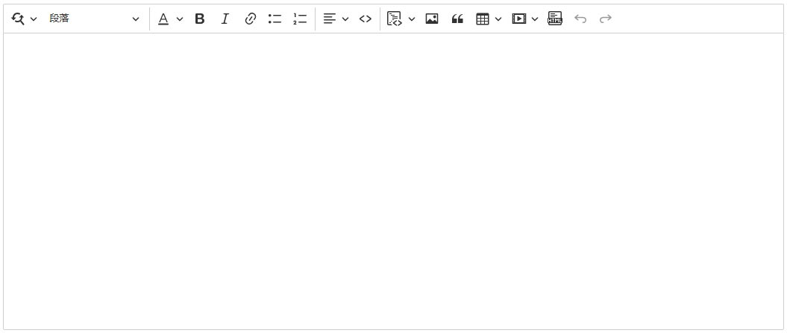
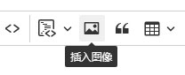

# Blazor Ckeditor Component

```json
//[doc-params]
{
    "UI": ["Blazor", "BlazorServer"]
}
```

The Blazor version of Ckeditor is suitable for both Blazor Server and Blazor WebAssembly.



## Installation

* Install the `Dignite.Abp.AspNetCore.Components.CkEditor` NuGet package in your Blazor project.

{{if UI == "Blazor"}}

* Install the `Dignite.Abp.AspNetCore.Components.CkEditor.WebAssembly` NuGet package in your Blazor WebAssembly Web project.

* Add `DigniteAbpAspNetCoreComponentsCkEditorWebAssemblyModule` to the `[DependsOn(...)]` attribute list of your [module class](https://docs.abp.io/en/abp/latest/Module-Development-Basics).

* Run [abp bundle](https://docs.abp.io/en/abp/latest/CLI#bundle) once in your Blazor project.

* Add the following configuration under the `RemoteServices` node in the `appsettings.json` file:
  
  ``` json
  "FileExplorer": {
    "BaseUrl": "https://localhost:44321"
  }
  ```

{{end}}

{{if UI == "BlazorServer"}}

* Install the `Dignite.Abp.AspNetCore.Components.CkEditor.Server` NuGet package in your Blazor Server Web project.

* Add `DigniteAbpAspNetCoreComponentsCkEditorServerModule` to the `[DependsOn(...)]` attribute list of your [module class](https://docs.abp.io/en/abp/latest/Module-Development-Basics).

{{end}}

## Usage

Import the following namespace at the top of your page:

```csharp
@using Dignite.Abp.AspNetCore.Components.CkEditor
```

### Basic Usage

```html
<CkEditor @bind-Content="Content">
</CkEditor>
```

```csharp
public partial class TestCkEditor
{
    // Get or set the content of the Ckeditor
    public string Content { get; set; } = "CkEditor Default Content";
}
```

### Upload Images

First, set the container for storing images. For specific steps, please refer to [ABP BlobStoring](https://docs.abp.io/zh-Hans/abp/latest/Blob-Storing) and [Dignite Abp Files](Files.md).

> In this example, it's assumed that a container named `TestPicStore` has already been created.

```html
<CkEditor @bind-Content="Content" ImagesContainerName="TestPicStore">
</CkEditor>
```



Click the `Insert Image` tool, select a local file to upload it to the container named `TestPicStore`, and insert it into the editing area.

### Insert Video Media


In addition to the media supported by `Ckeditor` by default, this component also supports `Tencent Video`, `Youku Video`, and `Xigua Video`.

#### Video Media Parsing

Since `Ckeditor` converts inserted media into code like the following:

```html
<figure class="media"><oembed url="https://www.youtube.com/watch?v=Xf3ZUfESLeo"></oembed></figure>
```

You need to parse the video media from `Ckeditor` in the output page. Here's a sample code:

```javascript
/**
 * Parse videos inserted from ckeditor
 */
$(function () {
    // Select all <figure> elements with class "media"
    var figureElements = document.querySelectorAll('figure.media');
    var mediaEmbedProviders = [
        {
            name: 'ixigua',
            url: /^https:\/\/www\.ixigua\.com\/(\d+)(\?logTag=[\w\d]+)?/,
            html: match => {
                return `<iframe src='https://www.ixigua.com/iframe/${match[1]}?autoplay=0' title="Ixigua video player" allowFullScreen></iframe>`;
            }
        },
        {
            name: 'youtube',
            url: /https:\/\/www\.youtube\.com\/watch\?v=([^"']+)?/,
            html: match => {
                return `<iframe src="https://www.youtube.com/embed/${match[1]}" title="YouTube video player" allow="accelerometer; autoplay; clipboard-write; encrypted-media; gyroscope; picture-in-picture; web-share" allowfullscreen></iframe>`;
            }
        }
    ];

    // Loop through each <figure> element
    figureElements.forEach(function (figure) {
        var oembedElement = figure.firstChild;
        mediaEmbedProviders.forEach(function (provider) {
            var match = oembedElement.getAttribute('url').match(provider.url);
            if (match && match.length > 1) {
                var videoContainer = document.createElement('div');
                videoContainer.classList.add('ratio', 'ratio-16x9');
                videoContainer.innerHTML = provider.html(match);
                figure.appendChild(videoContainer);
            }
        });
    });
});
```
