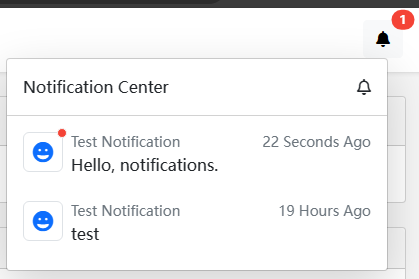

# Blazor Notification System

````json
//[doc-params]
{
    "UI": ["Blazor", "BlazorServer"]
}
````

## Installation

- Install the `Dignite.Abp.NotificationCenter.Blazor` NuGet package into your Blazor project.

  Add `AbpNotificationCenterBlazorModule` to the `[DependsOn(...)]` property list of the [module class](https://docs.abp.io/en/abp/latest/Module-Development-Basics).

{{if UI == "Blazor"}}

- Install the `Dignite.Abp.NotificationCenter.HttpApi.Client` NuGet package into your HttpApi.Client project.

  Add `AbpNotificationCenterHttpApiClientModule` to the `[DependsOn(...)]` property list of the [module class](https://docs.abp.io/en/abp/latest/Module-Development-Basics).

- Install the `Dignite.Abp.NotificationCenter.Blazor.WebAssembly` NuGet package into your Blazor.WebAssembly project.

  Add `AbpNotificationCenterBlazorWebAssemblyModule` to the `[DependsOn(...)]` property list of the [module class](https://docs.abp.io/en/abp/latest/Module-Development-Basics).

- Run [abp bundle](https://docs.abp.io/en/abp/latest/CLI#bundle) in your Blazor project.

{{end}}

{{if UI == "BlazorServer"}}

- Install the `Dignite.Abp.NotificationCenter.Blazor.Server` NuGet package into your Blazor.Server project.

  Add `AbpNotificationCenterBlazorServerModule` to the `[DependsOn(...)]` property list of the [module class](https://docs.abp.io/en/abp/latest/Module-Development-Basics).

{{end}}

## Notification Components

Each notification component consists of a notification icon component and a notification data component:



- Create a notification icon component

  Create a Blazor component by inheriting from the `NotificationIconComponentBase` abstract class.

  `NotificationName`: The notification name set in [Define a Notification](Notifications.md#define-a-notification).

  ```csharp
  @using Dignite.Abp.Notifications.Components;
  @using NotificationCenterSample.Notifications;
  @inherits NotificationIconComponentBase

  <Icon Name="IconName.Grin" IconSize="IconSize.Large" TextColor="TextColor.Primary"></Icon>

  @code {
    public override string NotificationName { get; } = NotificationCenterSampleNotifications.TestNotification;
  }
  ```

  If there is no corresponding icon component for the notification name, the system will use the default icon component.

- Create a notification data component

  Create a Blazor component by inheriting from the `NotificationDataComponentBase<TNotificationData>` abstract class.

  `TNotificationData`: The type inherited from the `NotificationData` abstract class.

  The system provides components for two notification data types: `MessageNotificationData` and `LocalizableMessageNotificationData`.

  Example of a notification data component for the `MessageNotificationData` notification data type:

  ```csharp
  @using Dignite.Abp.Notifications
  @inherits NotificationDataComponentBase<MessageNotificationData>
  <Paragraph Style="min-width:300px;">
    @NotificationData.Message
  </Paragraph>
  ```

## Sample

Download the sample from [GitHub](https://github.com/dignite-projects/dignite-abp/tree/main/samples/FileExplorerSample) and follow the instructions to experience the Blazor version of the notification system.
