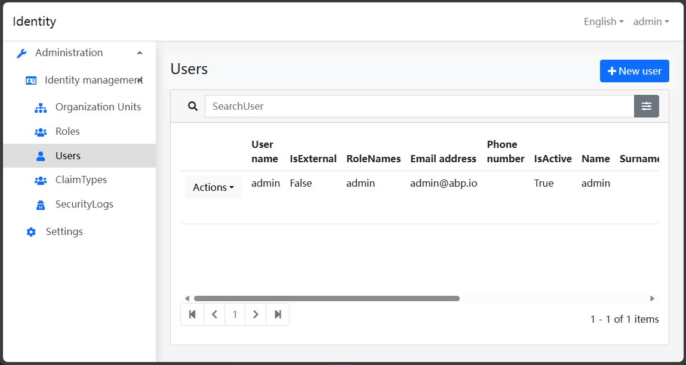

# Blazor UI: Pure Theme

```json
//[doc-params]
{
    "UI": ["Blazor", "BlazorServer"]
}
```

Pure Theme is an Abp Blazor theme built on top of [Blazorise](https://blazorise.com/).



## Installation

{{if UI == "Blazor"}}

> If your project initially installed the [Volo.Abp.AspNetCore.Components.WebAssembly.BasicTheme](https://www.nuget.org/packages/Volo.Abp.AspNetCore.Components.WebAssembly.BasicTheme) NuGet package, please remove it first.

* Install the `Dignite.Abp.AspNetCore.Components.WebAssembly.PureTheme` NuGet package into your Blazor WebAssembly Web project.
* Add `DigniteAbpAspNetCoreComponentsWebAssemblyPureThemeModule` to the `[DependsOn(...)]` property list in the [module class](https://docs.abp.io/en/abp/latest/Module-Development-Basics).
* In the `ConfigureServices` method, add the root component of the `Dignite.Abp.AspNetCore.Components.Web.PureTheme.Themes.Pure.App` application in your `BlazorWebAssemblyHostBuilder`:

    ```csharp
    var builder = context.Services.GetSingletonInstance<WebAssemblyHostBuilder>();
    builder.RootComponents.Add<App>("#ApplicationContainer");
    ```

    `#ApplicationContainer` is an element in your `index.html` (`<div id="ApplicationContainer">Loading...</div>`).

* Run [abp bundle](https://docs.abp.io/en/abp/latest/CLI#bundle) in your Blazor project.

{{end}}

{{if UI == "BlazorServer"}}

> If your project initially installed the [Volo.Abp.AspNetCore.Components.Server.BasicTheme](https://www.nuget.org/packages/Volo.Abp.AspNetCore.Components.Server.BasicTheme) NuGet package, please remove it first.

* Make sure you have installed the [AspNetCore Pure Theme](../AspNetCore-Pure-Theme.md).

* Install the `Dignite.Abp.AspNetCore.Components.Server.PureTheme` NuGet package into your Blazor Server Web project.

* Add `DigniteAbpAspNetCoreComponentsServerPureThemeModule` to the `[DependsOn(...)]` property list in the [module class](https://docs.abp.io/en/abp/latest/Module-Development-Basics).

* Make the following changes in the `Pages/_Host.cshtml` file:
  * At the top of the page, include the following namespaces:

    ```csharp
    @using Dignite.Abp.AspNetCore.Components.Server.PureTheme.Bundling
    @using Dignite.Abp.AspNetCore.Components.Web.PureTheme.Themes.Pure
    ```

  * Between the `<head>` tags, add the Pure Theme styles:

    ```html
    <abp-style-bundle name="@BlazorPureThemeBundles.Styles.Global" />
    ```

  * In the body of the page, add the `App` component from the Pure Theme:

    ```html
    <component type="typeof(App)" render-mode="Server" />
    ```

  * At the bottom of the `<body>` tag, add the Pure Theme JavaScript:

    ```html
    <abp-script-bundle name="@BlazorPureThemeBundles.Scripts.Global" />
    ```

{{end}}
