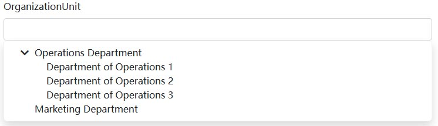

# BlazoriseUI Components

A collection of Blazor components based on [Blazorise](https://blazorise.com), including a draggable tree component, enhanced DataGrid, and more.

## Installation

> This project depends on the `Volo.Abp.BlazoriseUI` project. By installing this project, you get all the functionality of [Volo.Abp.BlazoriseUI](https://github.com/abpframework/abp/tree/dev/framework/src/Volo.Abp.BlazoriseUI).

In an ABP project, you can use these components by installing the `Dignite.Abp.BlazoriseUI` NuGet package. Additionally, add `[DependsOn(typeof(DigniteAbpBlazoriseUiModule))]` to the dependency list of your ABP module.

## AutoHeight Component

The `<AutoHeight>` component generates a `<div>` element that, starting from where it is inserted, calculates the height of the `<div>` to fill the remaining screen height based on the current viewport height.

If the content within the `<AutoHeight>` component exceeds its height, a scrollbar will appear.

### Basic Usage

```html
<AutoHeight>
    <div>This is an inner element.</div>
</AutoHeight>
```

### AutoHeight with ExtraHeight

Set the `ExtraHeight` value for the `<AutoHeight>` component, and the height of the `<AutoHeight>` component will be reduced by the specified `ExtraHeight` pixels.

```html
<AutoHeight ExtraHeight="45">
    <div>This is an inner element.</div>
</AutoHeight>
```

## ExtensibleDataGrid Component

The `ExtensibleDataGrid` component simplifies the usage of the `[Blazorise DataGrid](https://blazorise.com/docs/extensions/datagrid/getting-started)` component while adding new features like adaptive height and programmable `TableColumn`.

> `ExtensibleDataGrid` is typically used with `[AbpCrudPageBase](https://github.com/abpframework/abp/blob/dev/framework/src/Volo.Abp.BlazoriseUI/AbpCrudPageBase.cs)`.

### Basic Usage

```csharp
@inject ISiteAdminAppService SiteAdminAppService
@inherits AbpCrudPageBase<ISectionAdminAppService, SectionDto, Guid, GetSectionsInput, CreateSectionInput, UpdateSectionInput>
```

```html
<ExtensibleDataGrid TItem="SectionDto"
                    Data="@Entities"
                    ReadData="@OnDataGridReadAsync"
                    TotalItems="@TotalCount"
                    ShowPager="true"
                    PageSize="@PageSize"
                    CurrentPage="@CurrentPage"
                    Columns="@SectionManagementTableColumns">
</ExtensibleDataGrid>
```

```csharp
public partial class SectionManagement
{
    protected List<TableColumn> SectionManagementTableColumns => TableColumns.Get<SectionManagement>();
    
    protected override ValueTask SetTableColumnsAsync()
    {
        SectionManagementTableColumns
            .AddRange(new TableColumn[]
            {
                new TableColumn
                {
                    Title = L["DisplayName"],
                    Data = nameof(SectionDto.DisplayName)
                },
                new TableColumn
                {
                    Title = L["Name"],
                    Data = nameof(SectionDto.Name)
                },
                new TableColumn
                {
                    Title = L["Route"],
                    Data = nameof(SectionDto.Route)
                },
                new TableColumn
                {
                    Title = L["Template"],
                    Sortable = true,
                    Data = nameof(SectionDto.Template)
                }
            });

        return base.SetTableColumnsAsync();
    }
}
```

### SelectionMode

`SelectionMode` supports two modes: `Multiple?DataGridSelectionMode.Single` and `Multiple?DataGridSelectionMode.Multiple`, with the default value being `Multiple?DataGridSelectionMode.Single`.

If you set `SelectionMode` to `Multiple?DataGridSelectionMode.Multiple`, checkboxes will appear in front of each row.


To get the selected records:

```html
<ExtensibleDataGrid TItem="SectionDto" @ref="DataGridRef"
                    SelectionMode="Multiple?DataGridSelectionMode.Multiple: DataGridSelectionMode.Single"
                    Data="Entities"
                    ReadData="OnDataGridReadAsync"
                    TotalItems="TotalCount"
                    ShowPager="true"
                    PageSize="PageSize"
                    CurrentPage="@CurrentPage"
                    Columns="@SectionManagementTableColumns">
</ExtensibleDataGrid>
<Button Color="Color.Primary" Clicked="SelectSectionsAsync">Select Records</Button>
```

```csharp
public partial class SectionManagement
{        
    protected virtual async Task SelectSectionsAsync()
    {
        var items = DataGridRef.SelectedItems;
    }
}
```

### API

Here are all the properties of the `ExtensibleDataGrid` component:

- `TItem`: Specifies the data type.
- `Data`: Specifies the list of data of type `TItem`.
- `ReadData`: Asynchronously reads the list of data. If your page inherits from `AbpCrudPageBase`, you can directly use the `OnDataGridReadAsync` method.
- `TotalItems`: Specifies the total number of data items.
- `ShowPager`: Specifies whether to display pagination navigation.
- `CurrentPage`: Specifies the current page in data pagination.
- `Columns`: Specifies the list of `[TableColumn](https://github.com/abpframework/abp/blob/dev/framework/src/Volo.Abp.AspNetCore.Components.Web/Volo/Abp/AspNetCore/Components/Web/Extensibility/TableColumns/TableColumn.cs)`.
- `SelectionMode`: Specifies how data is selected, supporting `Multiple?DataGridSelectionMode.Single` and `Multiple?DataGridSelectionMode.Multiple`. The default value is `Multiple?DataGridSelectionMode.Single`.
- `ExtraHeight`: Specifies additional height for the `ExtensibleDataGrid` component, allowing developers to control its adaptive height.

## PasswordEdit Component

The `PasswordEdit` component is a wrapper for `<TextEdit Role="TextRole.Password"></TextEdit>`, adding the ability to toggle between displaying the password in plain text and generating a new random password.


### Basic Usage

```html
<PasswordEdit @bind-Password="NewPassword"></PasswordEdit>
```

### API

Here are all the properties of the `PasswordEdit` component:

- `Password`: Gets or sets the password within the input box.
- `PasswordChanged`: Event callback that triggers when the password is changed.
- `Length`: Sets the length of the randomly generated password (default value: 6).
- `Characters`: Sets the character set for the randomly generated password (default value: `ABCDEFGHIJKLMNOPQRSTUVWXYZabcdefghijklmnopqrstuvwxyz_-{}[]!@#$%^&*();'=+<>,.|?0123456789`).
- `Validator`: Validation handler for validating the selected value.
- `AsyncValidator`: Asynchronous validation handler for validating the selected value.

## ExtensibleTreeView Component

The `ExtensibleTreeView` component is a wrapper for the `[Blazorise TreeView](https://blazorise.com/docs/extensions/treeview)` component, preserving its original functionality while adding drag-and-drop capabilities.

### Basic Usage

```html
<ExtensibleTreeView TNode="Item" Nodes="Items" Draggable
          GetChildNodes="@(item => item.Children)"
          HasChildNodes="@(item => item.Children?.Any() == true)"
          @bind-SelectedNode="selected

Node"
          @bind-ExpandedNodes="expandedNodes"
          NodeDropped="@OnDropped">
    <NodeContent>
        <Icon Name="IconName.Folder" />
        @context.Text
    </NodeContent>
</ExtensibleTreeView>
```

```csharp
@code{
    public class Item
    {
        public string Text { get; set; }
        public IEnumerable<Item> Children { get; set; }
    }

    IEnumerable<Item> Items = new[]
    {
        new Item { Text = "Item 1" },
        new Item
        {
            Text = "Item 2",
            Children = new []
            {
                new Item { Text = "Item 2.1" },
                new Item
                {
                    Text = "Item 2.2",
                    Children = new []
                    {
                        new Item { Text = "Item 2.2.1" },
                        new Item { Text = "Item 2.2.2" },
                        new Item { Text = "Item 2.2.3" },
                        new Item { Text = "Item 2.2.4" }
                    }
                },
                new Item { Text = "Item 2.3" },
                new Item { Text = "Item 2.4" }
            }
        },
        new Item { Text = "Item 3" },
    };

    IList<Item> expandedNodes = new List<Item>();
    Item selectedNode;

    protected virtual async void OnDropped(DropNode<Item> dropNode)
    {
        if (dropNode.Node.Id == dropNode.Target.Id)
            return;

        if(dropNode.Area==DragEnterNodePosition.Inside)
        {
            // Drag and drop inside the target node
        }
        else if (position == DragEnterNodePosition.Bottom)
        {
            // Drag and drop below the target node
        }

        await this.InvokeAsync(() => this.StateHasChanged());
    }
}
```

### API

Here are all the properties of the `ExtensibleTreeView` component:

- `Nodes`: Binds to the list of nodes for the component.
- `NodeContent`: Template for displaying the node content.
- `SelectedNode`: Specifies the currently selected node.
- `SelectedNodeChanged`: Event callback triggered when a node is selected.
- `ExpandedNodes`: Specifies the list of currently expanded child nodes.
- `ExpandedNodesChanged`: Event callback triggered when the expanded nodes collection changes.
- `ClearNode`: Event callback triggered when a selected node is cleared.
- `GetChildNodes`: Specifies the method to get the list of child nodes for a node.
- `HasChildNodes`: Specifies the method to determine whether a node has child elements.
- `Draggable`: Enables or disables drag-and-drop functionality (default value: false).
- `NodeDropped`: Event callback triggered when a node is dragged and dropped.

## TreeSelect Component

The `TreeSelect` component is a dropdown tree-select component.



### Basic Usage

```html
<TreeSelect TNode="Item" TValue="string"
            Nodes="@Items"
            SelectedNodeChanged="OnSelectNodeChanged"
            GetChildNodes="@(item => item.Children)"
            HasChildNodes="@(item => item.Children?.Any() == true)"
            NodeText="x=>x.Text">
</TreeSelect>
```

```csharp
@code{
    public class Item
    {
        public string Text { get; set; }
        public IEnumerable<Item> Children { get; set; }
    }

    IEnumerable<Item> Items = new[]
    {
        new Item { Text = "Item 1" },
        new Item
        {
            Text = "Item 2",
            Children = new []
            {
                new Item { Text = "Item 2.1" },
                new Item
                {
                    Text = "Item 2.2",
                    Children = new []
                    {
                        new Item { Text = "Item 2.2.1" },
                        new Item { Text = "Item 2.2.2" },
                        new Item { Text = "Item 2.2.3" },
                        new Item { Text = "Item 2.2.4" }
                    }
                },
                new Item { Text = "Item 2.3" },
                new Item { Text = "Item 2.4" }
            }
        },
        new Item { Text = "Item 3" },
    };

    protected virtual Task OnSelectNodeChanged(Item args)
    {        
        Console.WriteLine(args.Text);
        return Task.CompletedTask;
    }
}
```

### API

Here are all the properties of the `TreeSelect` component:

- `Nodes`: Binds to the list of nodes for the component.
- `SelectedNode`: Specifies the currently selected node.
- `SelectedNodeChanged`: Event callback triggered when a node is selected.
- `ExpandedNodes`: Specifies the list of currently expanded child nodes.
- `ExpandedNodesChanged`: Event callback triggered when the expanded nodes collection changes.
- `ClearNode`: Event callback triggered when a selected node is cleared.
- `GetChildNodes`: Specifies the method to get the list of child nodes for a node.
- `HasChildNodes`: Specifies the method to determine whether a node has child elements.
- `NodeText`: Specifies the delegate for displaying node text.
- `Validator`: Validation handler for validating the selected value.
- `AsyncValidator`: Asynchronous validation handler for validating the selected value.
