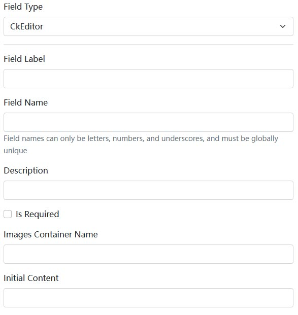

# CkEditor Dynamic Form

The CkEditor dynamic form component is part of the [Dignite.Abp.DynamicForms](Dynamic-Forms.md) module. For information on developing dynamic form components, please refer to [Blazor Dynamic Form Components](Blazor-Dynamic-Form-Components.md).

## Installation

To use the CkEditor dynamic form component:

1. Install the `Dignite.Abp.DynamicForms.CkEditor` NuGet package in the `Application Layer` of your `Contracts` project.

2. Add `AbpDynamicFormsCkEditorModule` to the `[DependsOn(...)]` attribute list of your [module class](https://docs.abp.io/en/abp/latest/Module-Development-Basics).

3. Install the `Dignite.Abp.DynamicForms.Components.CkEditor` NuGet package in your Blazor project.

4. Add `AbpDynamicFormsComponentsCkEditorModule` to the `[DependsOn(...)]` attribute list of your [module class](https://docs.abp.io/en/abp/latest/Module-Development-Basics).

The screenshot below shows the configuration of the CkEditor dynamic form in the [Dignite CMS](https://dignite.com/dignite-cms) backend:

