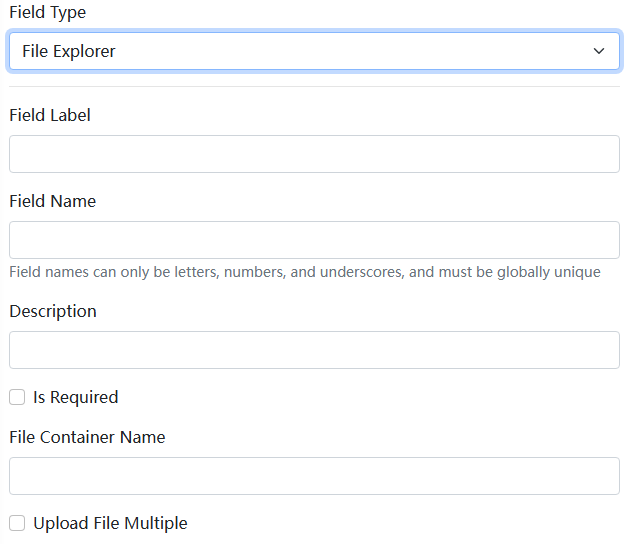

# Blazor File Dynamic Form Component

The File Dynamic Form component is part of the [Dignite.Abp.DynamicForms](Dynamic-Forms.md) module. For development information about dynamic form components, please refer to [Blazor Dynamic Form Components](Blazor-Dynamic-Form-Components.md).

## Installation

To use the File Dynamic Form component, follow these steps:

1. Install the `Dignite.Abp.DynamicForms.FileExplorer` NuGet package in the `Application Layer`'s `Contracts` project.

2. Add `AbpDynamicFormsFileExplorerModule` to the `[DependsOn(...)]` attribute list in your [module class](https://docs.abp.io/en/abp/latest/Module-Development-Basics).

3. Install the `Dignite.Abp.DynamicForms.Components.FileExplorer` NuGet package in your Blazor project.

4. Add `AbpDynamicFormsComponentsFileExplorerModule` to the `[DependsOn(...)]` attribute list in your [module class](https://docs.abp.io/en/abp/latest/Module-Development-Basics).

Below is a screenshot of the File Dynamic Form configuration in the [Dignite CMS](https://dignite.com/dignite-cms) backend:

