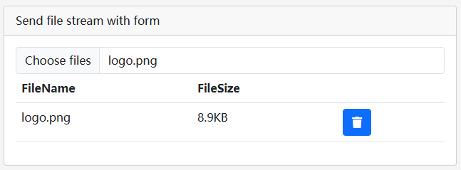

# File Explorer

```json
//[doc-params]
{
    "DB": ["EF", "Mongo"]
}
```

The File Explorer is an application module for the ABP framework used to upload files and record file information.

> Currently, only the Blazor version is available.

## Installation

- Install the `Dignite.FileExplorer.Domain.Shared` NuGet package in the `Domain.Shared` project.

  Add the `FileExplorerDomainSharedModule` to the `[DependsOn(...)]` property list in the [module class](https://docs.abp.io/en/abp/latest/Module-Development-Basics).

- Install the `Dignite.FileExplorer.Domain` NuGet package in the Domain project.

  Add the `FileExplorerDomainModule` to the `[DependsOn(...)]` property list in the [module class](https://docs.abp.io/en/abp/latest/Module-Development-Basics).

{{if DB == "EF"}}

- Install the `Dignite.FileExplorer.EntityFrameworkCore` NuGet package in the EntityFrameworkCore project.

  Add `FileExplorerEntityFrameworkCoreModule` to the `[DependsOn(...)]` property list in the [module class](https://docs.abp.io/en/abp/latest/Module-Development-Basics).

  Add `builder.ConfigureFileExplorer()` to the `OnModelCreating()` method:

  ```csharp
  protected override void OnModelCreating(ModelBuilder modelBuilder)
  {
      base.OnModelCreating(modelBuilder);

      modelBuilder.ConfigurePermissionManagement();
      modelBuilder.ConfigureSettingManagement();
      modelBuilder.ConfigureAuditLogging();
      modelBuilder.ConfigureIdentity();
      modelBuilder.ConfigureFeatureManagement();
      modelBuilder.ConfigureTenantManagement();
      modelBuilder.ConfigureFileExplorer(); //Add this line to configure the FileExplorer Module
  }
  ```

  Open Visual Studio's Package Manager Console, select `DbMigrations` as the default project, and then write the following command to add a migration for the File Explorer module:

  ```csharp
  add-migration Added_FileExplorer_Module
  ```

  Now update the database:

  ```csharp
  update-database
  ```

{{end}}

{{if DB == "Mongo"}}

- Install the `Dignite.FileExplorer.MongoDB` NuGet package in the MongoDB project.

  Add `FileExplorerEntityMongoDBModule` to the `[DependsOn(...)]` property list in the [module class](https://docs.abp.io/en/abp/latest/Module-Development-Basics).

  Add `builder.ConfigureFileExplorer()` to the `OnModelCreating()` method:

  ```csharp
  protected override void OnModelCreating(ModelBuilder modelBuilder)
  {
      base.OnModelCreating(modelBuilder);

      modelBuilder.ConfigurePermissionManagement();
      modelBuilder.ConfigureSettingManagement();
      modelBuilder.ConfigureAuditLogging();
      modelBuilder.ConfigureIdentity();
      modelBuilder.ConfigureFeatureManagement();
      modelBuilder.ConfigureTenantManagement();
      modelBuilder.ConfigureFileExplorer(); //Add this line to configure the FileExplorer Module
  }
  ```

{{end}}

- Install the `Dignite.FileExplorer.Application.Contracts` NuGet package in the Application.Contracts project.

  Add `FileExplorerApplicationContractsModule` to the `[DependsOn(...)]` property list in the [module class](https://docs.abp.io/en/abp/latest/Module-Development-Basics).

- Install the `Dignite.FileExplorer.Application` NuGet package in the Application project.

  Add `FileExplorerApplicationModule` to the `[DependsOn(...)]` property list in the [module class](https://docs.abp.io/en/abp/latest/Module-Development-Basics).

- Install the `Dignite.FileExplorer.HttpApi` NuGet package in the HttpApi project.

  Add `FileExplorerHttpApiModule` to the `[DependsOn(...)]` property list in the [module class](https://docs.abp.io/en/abp/latest/Module-Development-Basics).

## Configuring the File Grid

The file grid allows you to separate containers into cells, making it easier to store files in cells.

For example, a picture of a car is divided into three cells: appearance, interior, and others.

````csharp
Configure<AbpBlobStoringOptions>(options =>
{
    options.Containers.Configure<CarPictureContainer>(container =>
    {        
        container.SetFileGridConfiguration(fg => fg.FileCells = new List<FileCell>
        {
            new FileCell("appearance",L("appearance")),               //Appearance
            new FileCell("interior",L("interior")),                   //Interior
            new FileCell("other",L("other")),                          //Others
        });
    });
});
````

## Image Width and Height Resizer

This module introduces an image width and height resizer. When the uploaded image's width or height exceeds the configured dimensions, the resizer automatically compresses the image's width and height.

Configure allowed file types in the `ConfigureServices` method:

```csharp
Configure<AbpBlobStoringOptions>(options =>
{
    options.Containers.Configure<ProfilePictureContainer>(container =>
    {
        container.AddImageResizeHandler(handler =>
        {
            handler.ImageWidth = 256;
            handler.ImageHeight = 256;
        });
    });
});
```

## Configuring File Management Permissions

Restrict user access to files by configuring permissions.

In the `ConfigureServices` method in the Application project, configure allowed file types:

```csharp
Configure<AbpBlobStoringOptions>(options =>
{
    options.Containers.Configure<ProfilePictureContainer>(container =>
    {
        container.SetAuthorizationConfiguration(config =>
        {
            config.CreateDirectoryPermissionName = CmsAdminPermissions.Entry.Create;  // Set permission to create folders
            config.CreateFilePermissionName = CmsAdminPermissions.Entry.Create;       // Set permission to upload files
            config.UpdateFilePermissionName = CmsAdminPermissions.Entry.Update;       // Set permission to modify file information
            config.DeleteFilePermissionName = CmsAdminPermissions.Entry.Delete;       // Set permission to delete files
        });
    });
});
```

### Inheriting User Access to Business Objects

In many cases, files are associated with a business object, and users must have access to that business object to access its files.

1. Configure authorization policies following [Policy-Based Authorization in ASP.NET Core](https://learn.microsoft.com/en-us/aspnet/core/security/authorization/policies).

2. Integrate policy authorization with file management.

   Inherit from the `FileDescriptorEntityAuthorizationHandlerBase` abstract class and override the `GetResourceAsync` method:

   ```csharp
   public class EntryResourceAuthorizationHandler : FileDescriptorEntityAuthorizationHandlerBase<Entry>, ITransientDependency
    {
        private readonly IRepository<Entry, Guid> _entryRepository;

        public EntryResourceAuthorizationHandler(IRepository<Entry, Guid> entryRepository)
        {
            _entryRepository = entryRepository;
        }

        public override async Task<Entry> GetResourceAsync(FileDescriptor file)
        {
            var entryId = Guid.Parse(file.EntityId);
            var entry = await _entryRepository.GetAsync(entryId, false);
            return entry; 
        }
    }
   ```

   Configure it in the `ConfigureServices` method in the Application project like this:

   ```csharp
   Configure<AbpBlobStoringOptions>(options =>
   {
       options.Containers.Configure<ProfilePictureContainer>(container =>
       {
           container.SetAuthorizationConfiguration(config =>
           {
               config.CreateDirectoryPermissionName = CmsAdminPermissions.Entry.Create;  // Set permission to create folders
               config.CreateFilePermissionName = CmsAdminPermissions.Entry.Create;       // Set permission to upload files
               config.UpdateFilePermissionName = CmsAdminPermissions.Entry.Update;       // Set permission to modify file information
               config.DeleteFilePermissionName = CmsAdminPermissions.Entry.Delete;       // Set permission to delete files
               config.SetAuthorizationHandler<EntryResourceAuthorizationHandler>(); 
           });
       });
   });
   ```

## BlobName Generator

By default, the BlobName is a newly generated Guid value. You can generate BlobNames according to your rules by implementing the `IBlobNameGenerator` interface. Here's an example:

```csharp
public class YearMonthBlobNameGenerator : IBlobNameGenerator, ITransientDependency
{
    public Task<string> Create()
    {
        return Task.FromResult(
            DateTime.Now.Year.ToString() + "/" + DateTime.Now.Month.ToString() + "/" + Guid.NewGuid().ToString("N")
            );
    }
}
```

Configure it in the `ConfigureServices` method in the Application project like this:

```csharp
Configure<AbpBlobStoringOptions>(options =>
{
    options.Containers.Configure<ProfilePictureContainer>(container =>
    {
        container.SetBlobNameGenerator<YearMonthBlobNameGenerator>();
    });
});
```

## File Upload

### File Component

Users can select files without immediately uploading them to the server. They are uploaded to the server when the entire form is submitted.



- Usage example:

    ```html
    <FileEditComponent ContainerName="@ProfilePictureContainer.ContainerName" Multiple="true">
    </FileEditComponent>
    ```

- Specify the associated entity:

    ```html
    <FileEditComponent ContainerName="@ProfilePictureContainer.ContainerName" Multiple="true" EntityId="7c804a75-665c-c575-13e5-3a07b0bbb0fe">
    </FileEditComponent>
    ```

- Component properties:
  - ContainerName

    Name of the file storage container.
    > For more information about storage containers, see [Typed IBlobContainer](https://docs.abp.io/en/abp/latest/Blob-Storing#typed-iblobcontainer).

  - CellName

    The name of the file storage cell.

  - Multiple

    Whether to allow multiple file selection.

  - EntityId

    Identifier of the associated business object entity.

  - FileDescriptors

    List of uploaded files.

  - FileDescriptorsChanged

    Event triggered when the list of uploaded files changes.

  - FileDescriptorsContent

    Blazor template for rendering the list of uploaded files.
    > For more information about Blazor templates, see [ASP.NET Core Blazor Templated Components](https://learn.microsoft.com/en-us/aspnet/core/blazor/components/templated-components).

  - FileChanged

    Event triggered after selecting a file.

  - FilesContent

    Blazor template for rendering the selected files.
    > For more information about Blazor templates, see [ASP.NET Core Blazor Templated Components](https://learn.microsoft.com/en-us/aspnet/core/blazor/components/templated-components).

  - Validator

    Validation handler for the file component.

  - AsyncValidator

    Asynchronous validation handler for the file component.

### File Picker Component

Users can select previously uploaded files or immediately upload a new file.


- Usage example:

    ```html
    <FilePickerComponent ContainerName="@ProfilePictureContainer.ContainerName" Multiple="false">                        
    </FilePickerComponent>
    ```

- Specify the associated entity:

    ```html
    <FilePickerComponent ContainerName="@ProfilePictureContainer.ContainerName" Multiple="true" EntityId="7c804a75-665c-c575-13e5-3a07b0bbb0fe">
    </FilePickerComponent>
    ```

- Component properties:
  - ContainerName

    Name of the file storage container.
    > For more information about storage containers, see [Typed IBlobContainer](https://docs.abp.io/en/abp/latest/Blob-Storing#typed-iblobcontainer).

  - CellName

    The name of the file storage cell.

  - Multiple

    Whether to allow multiple file selection.

  - EntityId

    Identifier of the associated business object entity.

  - FileDescriptors

    List of uploaded files.

  - FileDescriptorsChanged

    Event triggered when the list of uploaded files changes.

  - FileDescriptorsContent

    Blazor template for rendering the list of uploaded files.
    > For more information about Blazor templates, see [ASP.NET Core Blazor Templated Components](https://learn.microsoft.com/en-us/aspnet/core/blazor/components/templated-components).

  - OpeningFileExplorerModal

    Event triggered when opening the file selection modal.

  - Validator

    Validation handler for the file component.

  - AsyncValidator

    Asynchronous validation handler for the file component.
