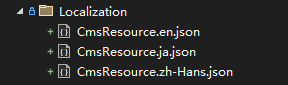
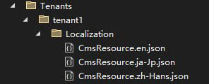

# Multi-Tenant Localization

Multi-tenant localization allows each tenant to have its own set of localized content. This feature is useful for scenarios such as website design, where each tenant's website can use a localized system tailored to their specific needs.

## Installation

1. Install the `Dignite.Abp.Localization` NuGet package in your web project.
2. Add `AbpLocalizationModule` to the `[DependsOn(...)]` attribute list in your [module class](https://docs.abp.io/en/abp/latest/Module-Development-Basics).

## Creating a Localization Resource File

Create a localization resource file class under the `/Localization/` directory and add a `MultiTenancyLocalizationResourceName` attribute to the class, for example:

```csharp
[MultiTenancyLocalizationResourceName]
public class CmsResource
{
}
```

JSON localization files for tenants are located in the `/Localization/` folder.



Folders are created based on the names of the tenants in the `/Tenants/{TenantName}/Localization/` folder.



The content of JSON localization files looks like this:

```json
{
  "HelloWorld": "Hello World!"
}
```

## Retrieving Localized Text

### Simple Usage in a Class

Simply inject the `IStringLocalizer<TResource>` service and use it as follows:

```csharp
public class MyService : ITransientDependency
{
    private readonly IStringLocalizer<CmsResource> _localizer;

    public MyService(IStringLocalizer<CmsResource> localizer)
    {
        _localizer = localizer;
    }

    public void Foo()
    {
        var str = _localizer["HelloWorld"];
    }
}
```

### Using in Razor Views/Pages

Inject the `IStringLocalizer<TResource>` service in Razor views/pages like this:

```csharp
@inject IStringLocalizer<CmsResource> _localizer

<h1>@_localizer["HelloWorld"]</h1>
```

### Formatting Parameters

You can pass formatting parameters after the localization key. For example, if your message is `Hello {0}, welcome!`, you can pass the `{0}` parameter to the localizer like this: `_localizer["HelloMessage", "John"]`.

> For more details on using localization, refer to the [Microsoft Localization Documentation](https://docs.microsoft.com/en-us/aspnet/core/fundamentals/localization).
