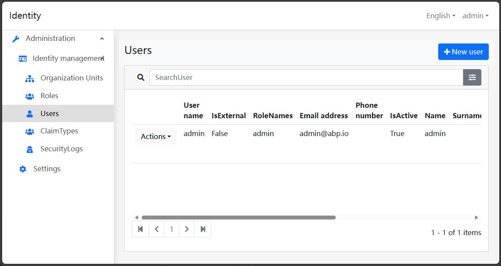

# Blazor UI: Pure Theme

```json
//[doc-params]
{
    "UI": ["Blazor", "BlazorServer"]
}
```

Pure Theme は [Blazorise](https://blazorise.com/) の上に構築された Abp Blazor テーマです。



## インストール

{{if UI == "Blazor"}}

> プロジェクトが初期状態で [Volo.Abp.AspNetCore.Components.WebAssembly.BasicTheme](https://www.nuget.org/packages/Volo.Abp.AspNetCore.Components.WebAssembly.BasicTheme) NuGet パッケージをインストールしている場合、まずそれを削除してください。

* `Dignite.Abp.AspNetCore.Components.WebAssembly.PureTheme` NuGet パッケージを Blazor WebAssembly Web プロジェクトにインストールします。
* [モジュールクラス](https://docs.abp.io/en/abp/latest/Module-Development-Basics) の `[DependsOn(...)]` プロパティリストに `DigniteAbpAspNetCoreComponentsWebAssemblyPureThemeModule` を追加します。
* `ConfigureServices` メソッド内で、`BlazorWebAssemblyHostBuilder` に `Dignite.Abp.AspNetCore.Components.Web.PureTheme.Themes.Pure.App` アプリケーションのルートコンポーネントを追加します：

    ```csharp
    var builder = context.Services.GetSingletonInstance<WebAssemblyHostBuilder>();
    builder.RootComponents.Add<App>("#ApplicationContainer");
    ```

    `#ApplicationContainer` は `index.html` の要素です（`<div id="ApplicationContainer">Loading...</div>`）。

* Blazor プロジェクトで [abp bundle](https://docs.abp.io/en/abp/latest/CLI#bundle) を実行します。

{{end}}

{{if UI == "BlazorServer"}}

> プロジェクトが初期状態で [Volo.Abp.AspNetCore.Components.Server.BasicTheme](https://www.nuget.org/packages/Volo.Abp.AspNetCore.Components.Server.BasicTheme) NuGet パッケージをインストールしている場合、まずそれを削除してください。

* [AspNetCore Pure Theme](../AspNetCore-Pure-Theme.md) をインストールしていることを確認してください。

* `Dignite.Abp.AspNetCore.Components.Server.PureTheme` NuGet パッケージを Blazor Server Web プロジェクトにインストールします。

* [モジュールクラス](https://docs.abp.io/en/abp/latest/Module-Development-Basics) の `[DependsOn(...)]` プロパティリストに `DigniteAbpAspNetCoreComponentsServerPureThemeModule` を追加します。

* `Pages/_Host.cshtml` ファイルで以下の変更を行います：
  * ページのトップに、次の名前空間をインクルードします：

    ```csharp
    @using Dignite.Abp.AspNetCore.Components.Server.PureTheme.Bundling
    @using Dignite.Abp.AspNetCore.Components.Web.PureTheme.Themes.Pure
    ```

  * `<head>` タグの間に Pure Theme のスタイルを追加します：

    ```html
    <abp-style-bundle name="@BlazorPureThemeBundles.Styles.Global" />
    ```

  * ページの本文に、Pure Theme の `App` コンポーネントを追加します：

    ```html
    <component type="typeof(App)" render-mode="Server" />
    ```

  * `<body>` タグの最下部に Pure Theme の JavaScript を追加します：

    ```html
    <abp-script-bundle name="@BlazorPureThemeBundles.Scripts.Global" />
    ```

{{end}}
