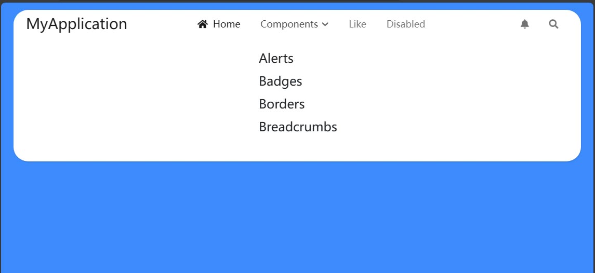

# ASP.NET Core MVC / Razor Pages: Pure Theme

Pure Themeは、ASP.NET Core MVC / Razor PagesのUI用のテーマです。

## インストール

> プロジェクトに初めに`Volo.Abp.AspNetCore.Mvc.UI.Theme.Basic` NuGetパッケージがインストールされている場合は、まずそれを削除してください。

Pure ThemeをWebプロジェクトにインストールするには、次の手順に従ってください：

1. `Dignite.Abp.AspNetCore.Mvc.UI.Theme.Pure` NuGetパッケージをインストールします。

2. [モジュールクラス](https://docs.abp.io/en/abp/latest/Module-Development-Basics)の`[DependsOn(...)]`属性リストに`AbpAspNetCoreMvcUiPureThemeModule`を追加します。

3. `ConfigureServices`メソッドでデフォルトのテーマを設定します：

    ```csharp
    Configure<AbpThemingOptions>(options =>
    {
        options.DefaultThemeName = PureTheme.Name;
    });
    ```

4. Webプロジェクトに[@abp/aspnetcore.mvc.ui.theme.basic](https://www.npmjs.com/package/@abp/aspnetcore.mvc.ui.theme.basic) NPMパッケージをインストールします（例：`npm install @abp/aspnetcore.mvc.ui.theme.basic`または`yarn add @abp/aspnetcore.mvc.ui.theme.basic`）。

5. [abp install-libs](https://docs.abp.io/en/abp/latest/CLI#install-libs)コマンドを実行します。

## レイアウト

### Public レイアウト

Pure ThemeにはPublicレイアウトが含まれています：



## サンプル

サンプルは、[GitHub](https://github.com/dignite-projects/dignite-abp/tree/main/samples/PureTheme.BlazorServerSample)にアクセスし、サンプルをダウンロードして指示に従って実行して体験できます。
