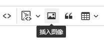

# Blazor Ckeditor コンポーネント

``` json
//[doc-params]
{
    "UI": ["Blazor", "BlazorServer"]
}
```

CkeditorのBlazorバージョンは、Blazor ServerとBlazor WebAssemblyに適しています。


## インストール

* `Dignite.Abp.AspNetCore.Components.CkEditor` NuGet パッケージをBlazorプロジェクトにインストールします。

{{if UI == "Blazor"}}

* Blazor WebAssembly Webプロジェクトに`Dignite.Abp.AspNetCore.Components.CkEditor.WebAssembly` NuGet パッケージをインストールします。

* [モジュールクラス](https://docs.abp.io/en/abp/latest/Module-Development-Basics) の `[DependsOn(...)]` 属性リストに `AbpAspNetCoreComponentsCkEditorWebAssemblyModule` を追加します。

* Blazorプロジェクトで[abp bundle](https://docs.abp.io/en/abp/latest/CLI#bundle)を実行します。

* appsettings.json`ファイルの`RemoteServices`ノードの下に以下の設定を追加する：
  
  ``` json
  "FileExplorer": {
    "BaseUrl": "https://localhost:44321"
  }
  ```

{{end}}

{{if UI == "BlazorServer"}}

* Blazor Server Webプロジェクトに`Dignite.Abp.AspNetCore.Components.CkEditor.Server` NuGet パッケージをインストールします。

* [モジュールクラス](https://docs.abp.io/en/abp/latest/Module-Development-Basics) の `[DependsOn(...)]` 属性リストに `AbpAspNetCoreComponentsCkEditorServerModule` を追加します。

{{end}}

## 使用方法

ページのトップで以下の名前空間をインポートします。

```csharp
@using Dignite.Abp.AspNetCore.Components.CkEditor
```

### 基本的な使用法

```html
<CkEditor @bind-Content="Content">
</CkEditor>
```

```csharp
public partial class TestCkEditor
{
    // Ckeditorのコンテンツを取得または設定します
    public string Content { get; set; } = "CkEditor デフォルトコンテンツ";
}
```

### 画像のアップロード

まず、画像の保存先コンテナを設定します。具体的な操作方法については、[ABP BlobStoring](https://docs.abp.io/zh-Hans/abp/latest/Blob-Storing) および [Dignite Abp Files](Files.md) を参照してください。

> この例では、`TestPicStore` という名前のコンテナが作成されていると仮定しています。

```html
<CkEditor @bind-Content="Content" ImagesContainerName="TestPicStore">
</CkEditor>
```



`画像挿入` ツールをクリックし、ローカルファイルを選択し、`TestPicStore` という名前のコンテナにアップロードし、エディタエリアに挿入します。

### 動画メディアの挿入


`Ckeditor` はデフォルトでサポートしているメディアに加えて、`腾讯ビデオ`、`Youkuビデオ`、`Xiguaビデオ` をサポートしています。

#### 動画メディアの解析

`Ckeditor` は挿入されたメディアを次のようなコードに変換します：

```html
<figure class="media"><oembed url="https://www.youtube.com/watch?v=Xf3ZUfESLeo"></oembed></figure>
```

したがって、ページで `Ckeditor` から挿入された動画メディアを解析する必要があります。解析のコードは以下のようになります：

```javascript
/**
 * Ckeditorから挿入された動画を解析します
 */
$(function () {
    // classが"media"のすべての<figure>要素を選択します
    var figureElements = document.querySelectorAll('figure.media');
    var mediaEmbedProviders = [
        {
            name: 'ixigua',
            url: /^https:\/\/www\.ixigua\.com\/(\d+)(\?logTag=[\w\d]+)?/,
            html: match => {
                return `<iframe src='https://www.ixigua.com/iframe/${match[1]}?autoplay=0' title="Ixigua video player" allowFullScreen></iframe>`;
            }
        },
        {
            name: 'youtube',
            url: /https:\/\/www\.youtube\.com\/watch\?v=([^"']+)?/,
            html: match => {
                return `<iframe src="https://www.youtube.com/embed/${match[1]}" title="YouTube video player" allow="accelerometer; autoplay; clipboard-write; encrypted-media; gyroscope; picture-in-picture; web-share" allowfullscreen></iframe>`;
            }
        }
    ];

    // すべての<figure>要素をループします
    figureElements.forEach(function (figure) {
        var oembedElement = figure.firstChild;
        mediaEmbedProviders.forEach(function (provider) {
            var match = oembedElement.getAttribute('url').match(provider.url);
            if (match && match.length > 1) {
                var videoContainer = document.createElement('div');
                videoContainer.classList.add('ratio', 'ratio-16x9');
                videoContainer.innerHTML = provider.html(match);
                figure.appendChild(videoContainer);
            }
        });
    });
});
```
