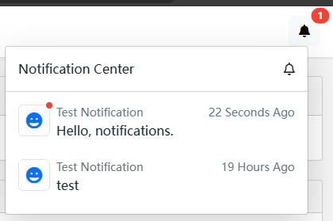

# Blazor 通知システム

````json
//[doc-params]
{
    "UI": ["Blazor", "BlazorServer"]
}
````

## インストール

- `Dignite.Abp.NotificationCenter.Blazor` NuGet パッケージを Blazor プロジェクトにインストールします。

  [モジュールクラス](https://docs.abp.io/en/abp/latest/Module-Development-Basics) の `[DependsOn(...)]` プロパティリストに `DigniteAbpNotificationCenterBlazorModule` を追加します。

{{if UI == "Blazor"}}

- `Dignite.Abp.NotificationCenter.HttpApi.Client` NuGet パッケージを HttpApi.Client プロジェクトにインストールします。

  [モジュールクラス](https://docs.abp.io/en/abp/latest/Module-Development-Basics) の `[DependsOn(...)]` プロパティリストに `DigniteAbpNotificationCenterHttpApiClientModule` を追加します。

- `Dignite.Abp.NotificationCenter.Blazor.WebAssembly` NuGet パッケージを Blazor.WebAssembly プロジェクトにインストールします。

  [モジュールクラス](https://docs.abp.io/en/abp/latest/Module-Development-Basics) の `[DependsOn(...)]` プロパティリストに `DigniteAbpNotificationCenterBlazorWebAssemblyModule` を追加します。

- Blazor プロジェクトで [abp bundle](https://docs.abp.io/en/abp/latest/CLI#bundle) を実行します。

{{end}}

{{if UI == "BlazorServer"}}

- `Dignite.Abp.NotificationCenter.Blazor.Server` NuGet パッケージを Blazor.Server プロジェクトにインストールします。

  [モジュールクラス](https://docs.abp.io/en/abp/latest/Module-Development-Basics) の `[DependsOn(...)]` プロパティリストに `DigniteAbpNotificationCenterBlazorServerModule` を追加します。

{{end}}

## 通知コンポーネント

各通知コンポーネントは、通知アイコンコンポーネントと通知データコンポーネントから構成されます：



- 通知アイコンコンポーネントを作成します

  `NotificationIconComponentBase` 抽象クラスを継承して Blazor コンポーネントを作成します。

  `NotificationName`：[通知の定義](Notifications.md#定義通知) で設定された通知名です。

  ```csharp
  @using Dignite.Abp.Notifications.Components;
  @using NotificationCenterSample.Notifications;
  @inherits NotificationIconComponentBase

  <Icon Name="IconName.Grin" IconSize="IconSize.Large" TextColor="TextColor.Primary"></Icon>

  @code {
    public override string NotificationName { get; } = NotificationCenterSampleNotifications.TestNotification;
  }
  ```

  対応する通知名のアイコンコンポーネントが作成されていない場合、システムはデフォルトのアイコンコンポーネントを使用します。

- 通知データコンポーネントを作成します

  `NotificationDataComponentBase<TNotificationData>` 抽象クラスを継承して Blazor コンポーネントを作成します。

  `TNotificationData`: `NotificationData` 抽象クラスから継承した型です。

  システムには、組み込みの `MessageNotificationData` および `LocalizableMessageNotificationData` の2つの通知データタイプ用のコンポーネントが提供されています。

  `MessageNotificationData` 通知データタイプのコンポーネントのコード例：

  ```csharp
  @using Dignite.Abp.Notifications
  @inherits NotificationDataComponentBase<MessageNotificationData>
  <Paragraph Style="min-width:300px;">
    @NotificationData.Message
  </Paragraph>
  ```

## サンプル

[GitHub](https://github.com/dignite-projects/dignite-abp/tree/main/samples/FileExplorerSample) からサンプルをダウンロードし、指示に従って Blazor 版通知システムを体験してください。
