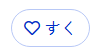

# お気に入り機能

Dignite CMS Kitは、任意のリソースにお気に入り/コレクションの機能を追加する**お気に入り**機能を提供します。たとえば、ユーザーは商品をお気に入りにしたり、ブログ記事をコレクションしたりできます。以下はサンプルページ上の外観です：



## お気に入り機能を有効にする

始める前に、Dignite Cms Kitのすべての機能を有効にしていない場合は、**お気に入り**機能を別途有効にする必要があります：

解決策の `Domain.Shared` プロジェクトで `GlobalFeatureConfigurator` クラスを開き、以下のコードを `Configure` メソッドに追加します。

````csharp
GlobalFeatureManager.Instance.Modules.DigniteCmsKit(cmsKit =>
{
    cmsKit.Favourites.Enable();
});
````

## オプション

**お気に入り**機能は、エンティティの種類ごとにお気に入りをグループ化するメカニズムを提供します。たとえば、**お気に入り**機能を商品に使用したい場合は、`Product` という名前のエンティティタイプを定義し、そのエンティティタイプの下にお気に入りを追加する必要があります。

`CmsKitFavouriteOptions` は `Domain` で構成でき、[モジュール](https://docs.abp.io/en/abp/latest/Module-Development-Basics) の `ConfigureServices` メソッドで構成します。たとえば：

```csharp
Configure<CmsKitFavouriteOptions>(options =>
{
    options.EntityTypes.Add(new FavouriteEntityTypeDefinition("Product"));
});
```

## ドメイン層

### リポジトリ

[リポジトリの最適な慣習と規約](https://docs.abp.io/en/abp/latest/Best-Practices/Repositories) ガイドに従います。

この機能用に定義されたカスタムリポジトリには以下が含まれます：

- `IFavouriteRepository`

### お気に入りマネージャ

`FavouriteManager` は `Favourite` 集約ルートでいくつかの操作を実行するために使用されます。

## アプリケーション層

### アプリケーションサービス

- `FavouritePublicAppService`（`IFavouritePublicAppService` を実装）：お気に入り機能のさまざまなメソッドを実装します。

## HttpApi層

### API インターフェース

- `FavouritePublicController`
  API エンドポイント：api/cms-kit-public/favourites
  お気に入りの追加/削除のためのインターフェースを実装します。
  