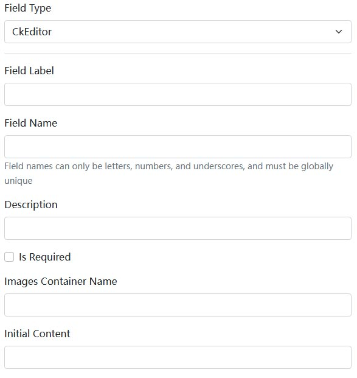

# CkEditor 動的フォーム

CkEditor 動的フォームコンポーネントは、[Dignite.Abp.DynamicForms](Dynamic-Forms.md)モジュールの一部です。動的フォームコンポーネントの開発に関する情報については、[Blazor 動的フォームコンポーネント](Blazor-Dynamic-Form-Components.md)を参照してください。

## インストール

CkEditor 動的フォームコンポーネントを使用するには、次の手順を実行します。

1. `Application Layer`の`Contracts`プロジェクトに`Dignite.Abp.DynamicForms.CkEditor` NuGet パッケージをインストールします。

2. [モジュールクラス](https://docs.abp.io/en/abp/latest/Module-Development-Basics)の`[DependsOn(...)]`属性リストに`AbpDynamicFormsCkEditorModule`を追加します。

3. Blazor プロジェクトで`Dignite.Abp.DynamicForms.Components.CkEditor` NuGet パッケージをインストールします。

4. [モジュールクラス](https://docs.abp.io/en/abp/latest/Module-Development-Basics)の`[DependsOn(...)]`属性リストに`AbpDynamicFormsComponentsCkEditorModule`を追加します。

以下のスクリーンショットは、CkEditor 動的フォームを[Dignite CMS](https://dignite.com/dignite-cms)のバックエンドで設定したものです：

