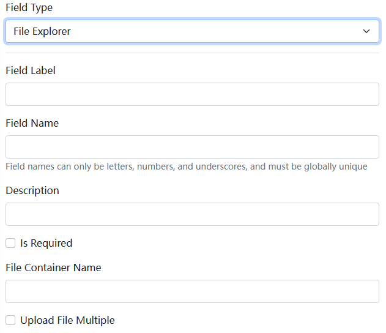

# Blazor ファイルダイナミックフォームコンポーネント

ファイルダイナミックフォームコンポーネントは [Dignite.Abp.DynamicForms](Dynamic-Forms.md) モジュールの一部であり、ダイナミックフォームコンポーネントに関する開発情報については [Blazor ダイナミックフォームコンポーネント](Blazor-Dynamic-Form-Components.md) を参照してください。

## インストール

ファイルダイナミックフォームコンポーネントを使用するには、次の手順を実行してください：

1. `Dignite.Abp.DynamicForms.FileExplorer` NuGet パッケージを `Application Layer` 内の `Contracts` プロジェクトにインストールします。

2. `[DependsOn(...)]` 属性リストで `AbpDynamicFormsFileExplorerModule` を指定して、[モジュールクラス](https://docs.abp.io/en/abp/latest/Module-Development-Basics) に追加します。

3. `Dignite.Abp.DynamicForms.Components.FileExplorer` NuGet パッケージを Blazor プロジェクトにインストールします。

4. `[DependsOn(...)]` 属性リストで `AbpDynamicFormsComponentsFileExplorerModule` を指定して、[モジュールクラス](https://docs.abp.io/en/abp/latest/Module-Development-Basics) に追加します。

以下は [Dignite CMS](https://dignite.com/dignite-cms) のバックエンドでのファイルダイナミックフォームの設定スクリーンショットです：

