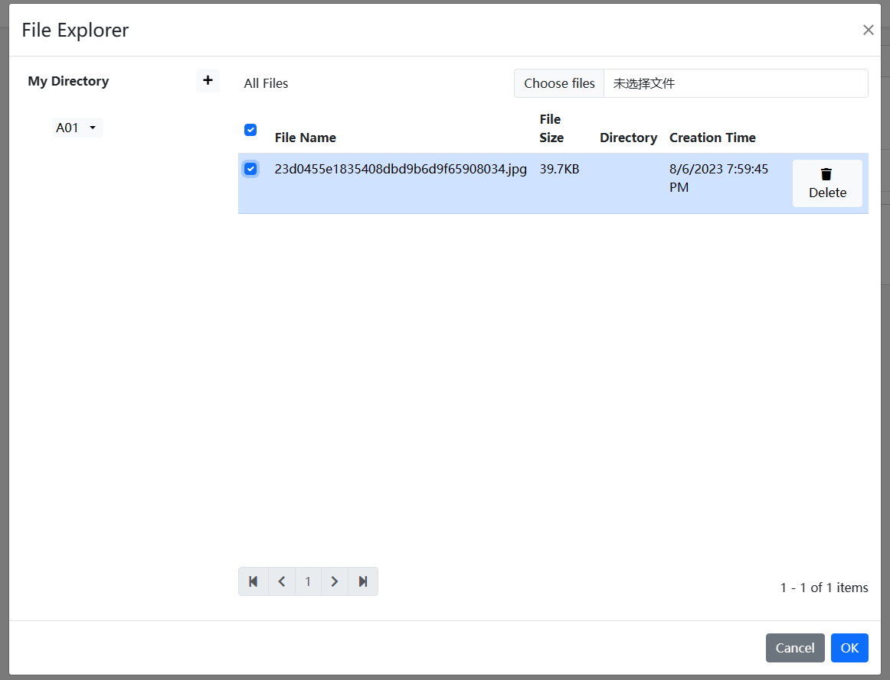

# ファイルマネージャー

````json
//[doc-params]
{
    "DB": ["EF", "Mongo"]
}
````

ファイルマネージャーは、ABPフレームワークのアプリケーションモジュールで、ファイルのアップロードとファイル情報の記録に使用されます。

> 現在、Blazorバージョンのみが利用可能です

## インストール

- `Dignite.FileExplorer.Domain.Shared` NuGetパッケージを`Domain.Shared`プロジェクトにインストールします。

   [モジュールクラス](https://docs.abp.io/en/abp/latest/Module-Development-Basics)の`[DependsOn(...)]`プロパティリストに`FileExplorerDomainSharedModule`を追加します。

- `Dignite.FileExplorer.Domain` NuGetパッケージをDomainプロジェクトにインストールします。

   [モジュールクラス](https://docs.abp.io/en/abp/latest/Module-Development-Basics)の`[DependsOn(...)]`プロパティリストに`FileExplorerDomainModule`を追加します。

{{if DB == "EF"}}

- `Dignite.FileExplorer.EntityFrameworkCore` NuGetパッケージをEntityFrameworkCoreプロジェクトにインストールします。

   `builder.ConfigureFileExplorer()`を`OnModelCreating()`メソッドに追加します：

    ```csharp
    protected override void OnModelCreating(ModelBuilder modelBuilder)
    {
        base.OnModelCreating(modelBuilder);

        modelBuilder.ConfigurePermissionManagement();
        modelBuilder.ConfigureSettingManagement();
        modelBuilder.ConfigureAuditLogging();
        modelBuilder.ConfigureIdentity();
        modelBuilder.ConfigureFeatureManagement();
        modelBuilder.ConfigureTenantManagement();
        modelBuilder.ConfigureFileExplorer(); // この行を追加してFileExplorerモジュールを設定します
    }
    ```

   Visual Studioのパッケージマネージャーコンソールを開き、`DbMigrations`をデフォルトのプロジェクトとして選択します。次に、次のコマンドを入力してドキュメントモジュールにマイグレーションを追加します。

    ```csharp
    add-migration Added_FileExplorer_Module
    ```

    今すぐデータベースを更新します

    ```csharp
    update-database
    ```

{{end}}

{{if DB == "Mongo"}}

- `Dignite.FileExplorer.MongoDB` NuGetパッケージをMongoDBプロジェクトにインストールします。

    `builder.ConfigureFileExplorer()`を`OnModelCreating()`メソッドに追加します：

    ```csharp
    protected override void OnModelCreating(ModelBuilder modelBuilder)
    {
        base.OnModelCreating(modelBuilder);

        modelBuilder.ConfigurePermissionManagement();
        modelBuilder.ConfigureSettingManagement();
        modelBuilder.ConfigureAuditLogging();
        modelBuilder.ConfigureIdentity();
        modelBuilder.ConfigureFeatureManagement();
        modelBuilder.ConfigureTenantManagement();
        modelBuilder.ConfigureFileExplorer(); // この行を追加してFileExplorerモジュールを設定します
    }
    ```

{{end}}

- `Dignite.FileExplorer.Application.Contracts` NuGetパッケージをApplication.Contractsプロジェクトにインストールします。

   [モジュールクラス](https://docs.abp.io/en/abp/latest/Module-Development-Basics)の`[DependsOn(...)]`プロパティリストに`FileExplorerApplicationContractsModule`を追加します。

- `Dignite.FileExplorer.Application` NuGetパッケージをApplicationプロジェクトにインストールします。

   [モジュールクラス](https://docs.abp.io/en/abp/latest/Module-Development-Basics)の`[DependsOn(...)]`プロパティリストに`FileExplorerApplicationModule`を追加します。

- `Dignite.FileExplorer.HttpApi` NuGetパッケージをHttpApiプロジェクトにインストールします。

   [モジュールクラス](https://docs.abp.io/en/abp/latest/Module-Development-Basics)の`[DependsOn(...)]`プロパティリストに`FileExplorerHttpApiModule`を追加します。

## ファイルグリッドの設定

ファイルグリッドを使うと、コンテナを複数のセルに分けることができ、セルにファイルを簡単に格納することができます。

例えば、車の写真を外装、内装、その他の3つのセルに分ける。

````csharp
Configure<AbpBlobStoringOptions>(options =>
{
    options.Containers.Configure<CarPictureContainer>(container =>
    {        
        container.SetFileGridConfiguration(fg => fg.FileCells = new List<FileCell>
        {
            new FileCell("appearance",L("appearance")),               //外装
            new FileCell("interior",L("interior")),                   //内装
            new FileCell("other",L("other")),                          //その他
        });
    });
});
````

## 画像の幅と高さのリサイズハンドラー

このモジュールには、アップロードされた画像の幅または高さが設定されたサイズを超える場合、ハンドラーが自動的に画像の幅と高さを圧縮する機能が追加されています。

`ConfigureServices`メソッド内で許可されるファイルのタイプを設定します：

````csharp
Configure<AbpBlobStoringOptions>(options =>
{
    options.Containers.Configure<ProfilePictureContainer>(container =>
    {
        container.AddImageResizeHandler(handler =>
        {
            handler.ImageWidth = 256;
            handler.ImageHeight = 256;
        });
    });
});
````

## ファイル管理のアクセス権の構成

アクセス権を構成して、ユーザーがファイルにアクセスできるよう制約を設けます。

`Application`プロジェクトの`ConfigureServices`メソッド内で、許

可されるファイルのタイプを設定します：

````csharp
Configure<AbpBlobStoringOptions>(options =>
{
    options.Containers.Configure<ProfilePictureContainer>(container =>
    {
        container.SetAuthorizationConfiguration(config =>
        {
            config.CreateDirectoryPermissionName = CmsAdminPermissions.Entry.Create;  // フォルダを作成するための権限を設定
            config.CreateFilePermissionName = CmsAdminPermissions.Entry.Create;       // ファイルをアップロードするための権限を設定
            config.UpdateFilePermissionName = CmsAdminPermissions.Entry.Update;       // ファイル情報を変更するための権限を設定
            config.DeleteFilePermissionName = CmsAdminPermissions.Entry.Delete;       // ファイルを削除するための権限を設定
        });
    });
});
````

### ビジネスオブジェクトへのアクセスポリシー認証の継承

多くの場合、ファイルは特定のビジネスオブジェクトに属しており、ユーザーはそのビジネスオブジェクトへのアクセス権を持っている場合にのみそのビジネスオブジェクトのファイルにアクセスできるようにする必要があります。

1. 認証ポリシーを構成します
   [ASP.NET Coreでのポリシーベースの認証](https://learn.microsoft.com/en-us/aspnet/core/security/authorization/policies)を参照して、ビジネスオブジェクトの認証を開発します。

2. ファイル管理の認証ポリシーと連携します
   `FileDescriptorEntityAuthorizationHandlerBase`抽象クラスを継承し、`GetResourceAsync`メソッドをオーバーライドします：

   ```csharp
   public class EntryResourceAuthorizationHandler : FileDescriptorEntityAuthorizationHandlerBase<Entry>, ITransientDependency
    {
        private readonly IRepository<Entry, Guid> _entryRepository;

        public EntryResourceAuthorizationHandler(IRepository<Entry, Guid> entryRepository)
        {
            _entryRepository = entryRepository;
        }

        public override async Task<Entry> GetResourceAsync(FileDescriptor file)
        {
            var entryId = Guid.Parse(file.EntityId);
            var entry = await _entryRepository.GetAsync(entryId,false);
            return entry; 
        }
    }
   ```

   `Application`プロジェクトの`ConfigureServices`メソッド内で以下のように構成します：

   ````csharp
   Configure<AbpBlobStoringOptions>(options =>
   {
       options.Containers.Configure<ProfilePictureContainer>(container =>
       {
           container.SetAuthorizationConfiguration(config =>
           {
               config.CreateDirectoryPermissionName = CmsAdminPermissions.Entry.Create;  // フォルダを作成するための権限を設定
               config.CreateFilePermissionName = CmsAdminPermissions.Entry.Create;       // ファイルをアップロードするための権限を設定
               config.UpdateFilePermissionName = CmsAdminPermissions.Entry.Update;       // ファイル情報を変更するための権限を設定
               config.DeleteFilePermissionName = CmsAdminPermissions.Entry.Delete;       // ファイルを削除するための権限を設定
               config.SetAuthorizationHandler<EntryResourceAuthorizationHandler>(); 
           });
       });
   });
   ````

## Blob名生成器

デフォルトでは、Blob名は新しい生成されたGuid値ですが、`IBlobNameGenerator`インターフェースを継承して独自のルールに従ってBlob名を生成できます。例：

```csharp
public class YearMonthBlobNameGenerator : IBlobNameGenerator, ITransientDependency
{
    public Task<string> Create()
    {
        return Task.FromResult(
            DateTime.Now.Year.ToString() + "/" + DateTime.Now.Month.ToString() + "/" + Guid.NewGuid().ToString("N")
            );
    }
}
```

`Application`プロジェクトの`ConfigureServices`メソッド内で以下のように構成します：

````csharp
Configure<AbpBlobStoringOptions>(options =>
{
    options.Containers.Configure<ProfilePictureContainer>(

container =>
    {
        container.SetBlobNameGenerator<YearMonthBlobNameGenerator>();
    });
});
````

## ファイルのアップロード

### ファイルコンポーネント

ユーザーがファイルを選択しても、サーバーにファイルを即座にアップロードしないで、フォーム全体を送信するときに一緒にサーバーに送信します。


- 基本的な使用法

    ````html
    <FileEditComponent ContainerName="@ProfilePictureContainer.ContainerName" Multiple="true">
    </FileEditComponent>
    ````

- 関連するエンティティを指定する

    ````html
    <FileEditComponent ContainerName="@ProfilePictureContainer.ContainerName" Multiple="true" EntityId="7c804a75-665c-c575-13e5-3a07b0bbb0fe">
    </FileEditComponent>
    ````

- コンポーネントのプロパティの説明
  - ContainerName

    ファイルの格納コンテナの名前。
    > [Typed IBlobContainer](https://docs.abp.io/en/abp/latest/Blob-Storing#typed-iblobcontainer)についてはこちらを参照してください。

  - CellName

    ファイル保存セルの名前。

  - Multiple

    複数のファイルの選択を許可するかどうか。

  - EntityId

    関連するビジネスオブジェクトエンティティのID。

  - FileDescriptors

    アップロードされたファイルのリスト。

  - FileDescriptorsChanged

    アップロードされたファイルのリストが変更されたときに発生するイベント。

  - FileDescriptorsContent

    アップロードされたファイルのリストを表示するBlazorテンプレート
    > [ASP.NET Core Blazor Templated Components](https://learn.microsoft.com/zh-cn/aspnet/core/blazor/components/templated-components)についてはこちらを参照してください。

  - FileChanged

    ファイルを選択した後に発生するイベント。

  - FilesContent

    ファイルを選択した後に表示されるBlazorテンプレート
    > [ASP.NET Core Blazor Templated Components](https://learn.microsoft.com/zh-cn/aspnet/core/blazor/components/templated-components)についてはこちらを参照してください。

  - Validator

    ファイルコンポーネントの検証ハンドラー。

  - AsyncValidator

    ファイルコンポーネントの非同期検証ハンドラー。

### ファイルピッカーコンポーネント

ユーザーは以前にアップロードしたファイルを選択することも、新しいファイルをすぐにアップロードすることもできます。



- 基本的な使用法

    ````html
    <FilePickerComponent ContainerName="@ProfilePictureContainer.ContainerName" Multiple="false">                        
    </FilePickerComponent>
    ````

- 関連するエンティティを指定する

    ````html
    <FilePickerComponent ContainerName="@ProfilePictureContainer.ContainerName" Multiple="true" EntityId="7c804a75-665c-c575-13e5-3a07b0bbb0fe">
    </FilePickerComponent>
    ````

- コンポーネントのプロパティの説明
  - ContainerName

    ファイルの格納コンテナの名前。
    > [Typed IBlobContainer](https://docs.abp.io/en/abp/latest/Blob-Storing#typed-iblobcontainer)についてはこちらを参照してください。

  - CellName

    ファイル保存セルの名前。

  - Multiple

    複数のファイルの選択を許可するかどうか。

  - EntityId

    関連するビジネスオブジェクトエンティティのID。

  - FileDescriptors

    アップロードされたファイルのリスト。

  - FileDescriptorsChanged

    アップロードされたファイルのリストが変更されたときに発生するイベント。

  - FileDescriptorsContent

    アップロードされたファイルのリストを表示するBlazorテンプレート
    > [ASP.NET Core Blazor Templated Components](https://learn.microsoft.com/zh-cn/aspnet/core/blazor/components/templated-components)についてはこちらを参照してください。

  - OpeningFileExplorerModal

    ファイル選択モーダルウィンドウを開くときに発生するイベント。

  - Validator

    ファイルコンポーネントの検証ハンドラー。

  - AsyncValidator

    ファイルコンポーネントの非同期検証ハンドラー。
