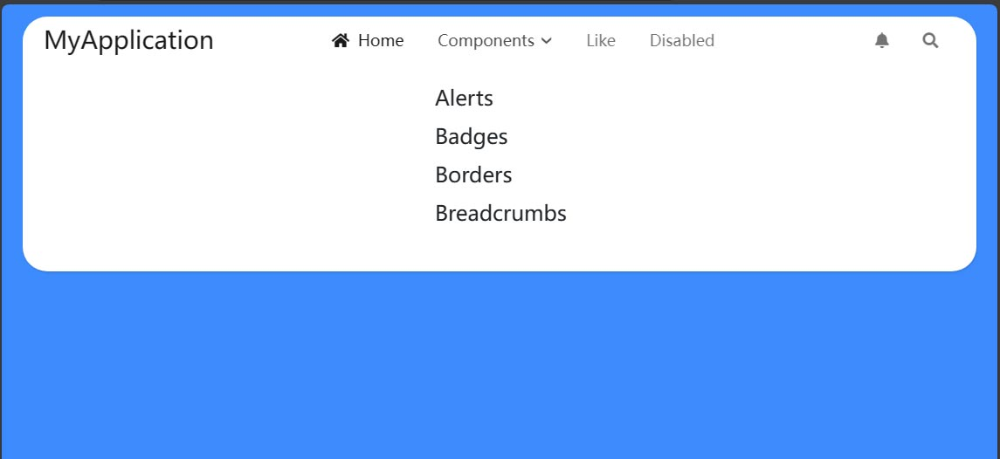

# ASP.NET Core MVC / Razor Pages: Pure Theme

Pure Theme 是为 ASP.NET Core MVC / Razor Pages UI 设计的主题。

## 安装

> 如果你的项目已经安装了 `Volo.Abp.AspNetCore.Mvc.UI.Theme.Basic` NuGet 包，请先卸载它。

1. 将 `Dignite.Abp.AspNetCore.Mvc.UI.Theme.Pure` NuGet 包安装到你的 Web 项目中。
2. 在 [模块类](https://docs.abp.io/en/abp/latest/Module-Development-Basics) 的 `[DependsOn(...)]` 属性列表中添加 `DigniteAbpAspNetCoreMvcUiPureThemeModule`。
3. 在 `ConfigureServices` 方法中配置默认主题：

    ```csharp
    Configure<AbpThemingOptions>(options =>
    {
        options.DefaultThemeName = PureTheme.Name;
    });
    ```

4. 在你的 Web 项目中安装 [@abp/aspnetcore.mvc.ui.theme.basic](https://www.npmjs.com/package/@abp/aspnetcore.mvc.ui.theme.basic) NPM 包（例如：`npm install @abp/aspnetcore.mvc.ui.theme.basic` 或者 `yarn add @abp/aspnetcore.mvc.ui.theme.basic`）。
5. 运行 [abp install-libs](https://docs.abp.io/en/abp/latest/CLI#install-libs) 命令。

## 布局

### Public 布局

Pure Theme 提供了 Public 布局：



## 示例

请前往 [GitHub](https://github.com/dignite-projects/dignite-abp/tree/main/samples/PureTheme.BlazorServerSample) 下载示例，并按照说明运行以体验它。
