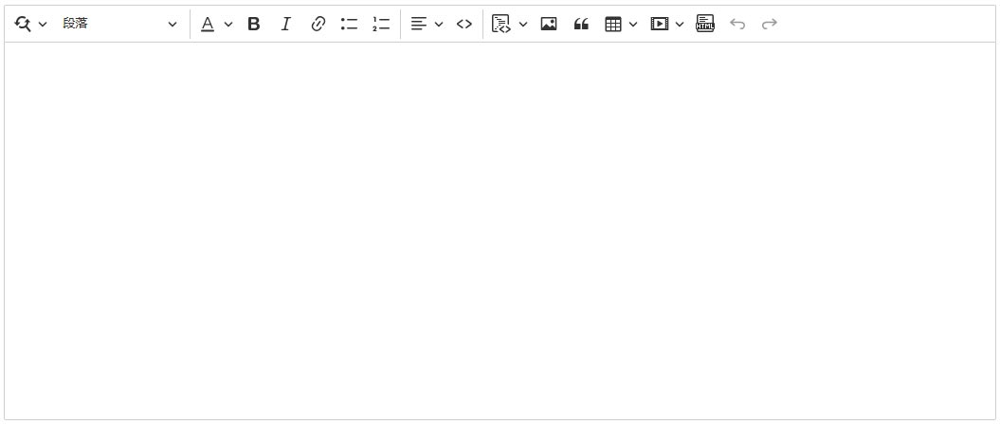
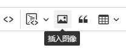

# Blazor Ckeditor 组件

``` json
//[doc-params]
{
    "UI": ["Blazor", "BlazorServer"]
}
```

Ckeditor 的 Blazor 版本，适用于 Blazor Server 和 Blazor WebAssembly。



## 安装

* 在 Blazor 项目中安装 `Dignite.Abp.AspNetCore.Components.CkEditor` NuGet 包。

{{if UI == "Blazor"}}

* 在 Blazor WebAssembly Web 项目中安装 `Dignite.Abp.AspNetCore.Components.CkEditor.WebAssembly` NuGet 包。

* 在 [模块类](https://docs.abp.io/en/abp/latest/Module-Development-Basics) 的 `[DependsOn(...)]` 属性列表中添加 `DigniteAbpAspNetCoreComponentsCkEditorWebAssemblyModule`。

* 在 Blazor 项目中执行一次 [abp bundle](https://docs.abp.io/en/abp/latest/CLI#bundle)。

{{end}}

{{if UI == "BlazorServer"}}

* 在 Blazor Server Web 项目中安装 `Dignite.Abp.AspNetCore.Components.CkEditor.Server` NuGet 包。

* 在 [模块类](https://docs.abp.io/en/abp/latest/Module-Development-Basics) 的 `[DependsOn(...)]` 属性列表中添加 `DigniteAbpAspNetCoreComponentsCkEditorServerModule`。

{{end}}

## 使用方法

在页面顶部引入以下命名空间：

```csharp
@using Dignite.Abp.AspNetCore.Components.CkEditor
```

### 基本用法

```html
<CkEditor @bind-Content="Content">
</CkEditor>
```

```csharp
public partial class TestCkEditor
{
    // 获取或设置 Ckeditor 内容
    public string Content { get; set; } = "CkEditor 默认内容";
}
```

### 上传图片

首先设置图片存储的容器，请参考 [ABP BlobStoring](https://docs.abp.io/zh-Hans/abp/latest/Blob-Storing) 和 [Dignite Abp Files](Files.md) 中的具体操作方法。

> 本例假设已创建名为 `TestPicStore` 的容器。

```html
<CkEditor @bind-Content="Content" ImagesContainerName="TestPicStore">
</CkEditor>
```



点击 `插入图像` 工具，选择本地文件将上传到名为 `TestPicStore` 的容器中，并插入编辑区。

### 插入视频媒体


除 `Ckeditor` 默认支持的媒体外，本组件还支持 `腾讯视频`、`优酷视频` 和 `西瓜视频`。

#### 视频媒体解析

由于 `Ckeditor` 会将插入的媒体转换为以下代码：

```html
<figure class="media"><oembed url="https://www.youtube.com/watch?v=Xf3ZUfESLeo"></oembed></figure>
```

因此，需要在输出页面中解析 `Ckeditor` 中的视频媒体，示例代码如下：

```javascript
/**
 * 解析ckeditor中引入的视频
 */
$(function () {
    // 选择所有带有类名 "media" 的 <figure> 元素
    var figureElements = document.querySelectorAll('figure.media');
    var mediaEmbedProviders = [
        {
            name: 'ixigua',
            url: /^https:\/\/www\.ixigua\.com\/(\d+)(\?logTag=[\w\d]+)?/,
            html: match => {
                return `<iframe src='https://www.ixigua.com/iframe/${match[1]}?autoplay=0' title="Ixigua video player" allowFullScreen></iframe>`;
            }
        },
        {
            name: 'youtube',
            url: /https:\/\/www\.youtube\.com\/watch\?v=([^"']+)?/,
            html: match => {
                return `<iframe src="https://www.youtube.com/embed/${match[1]}" title="YouTube video player" allow="accelerometer; autoplay; clipboard-write; encrypted-media; gyroscope; picture-in-picture; web-share" allowfullscreen></iframe>`;
            }
        }
    ];

    // 遍历每个 <figure> 元素
    figureElements.forEach(function (figure) {
        var oembedElement = figure.firstChild;
        mediaEmbedProviders.forEach(function (provider) {
            var match = oembedElement.getAttribute('url').match(provider.url);
            if (match && match.length > 1) {
                var videoContainer = document.createElement('div');
                videoContainer.classList.add('ratio', 'ratio-16x9');
                videoContainer.innerHTML = provider.html(match);
                figure.appendChild(videoContainer);
            }
        });
    });
});
```
