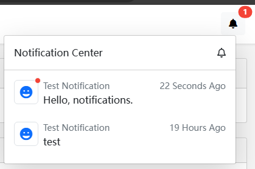

# Blazor 版通知系统

````json
//[doc-params]
{
    "UI": ["Blazor", "BlazorServer"]
}
````

## 安装

- 将 `Dignite.Abp.NotificationCenter.Blazor` Nuget 包安装到 Blazor 项目中

    添加 `DigniteAbpNotificationCenterBlazorModule` 到 [模块类](https://docs.abp.io/en/abp/latest/Module-Development-Basics) `[DependsOn(...)]`属性列表中。

{{if UI == "Blazor"}}

- 将 `Dignite.Abp.NotificationCenter.HttpApi.Client` Nuget 包安装到 HttpApi.Client 项目中

    添加 `DigniteAbpNotificationCenterHttpApiClientModule` 到 [模块类](https://docs.abp.io/en/abp/latest/Module-Development-Basics) `[DependsOn(...)]`属性列表中。

- 将 `Dignite.Abp.NotificationCenter.Blazor.WebAssembly` Nuget 包安装到 Blazor.WebAssembly 项目中

    添加 `DigniteAbpNotificationCenterBlazorWebAssemblyModule` 到 [模块类](https://docs.abp.io/en/abp/latest/Module-Development-Basics) `[DependsOn(...)]`属性列表中。

- 在Blazor项目中执行一次 [abp bundle](https://docs.abp.io/en/abp/latest/CLI#bundle)

{{end}}

{{if UI == "BlazorServer"}}

- 将 `Dignite.Abp.NotificationCenter.Blazor.Server` Nuget 包安装到 Blazor.Server 项目中

    添加 `DigniteAbpNotificationCenterBlazorServerModule` 到 [模块类](https://docs.abp.io/en/abp/latest/Module-Development-Basics) `[DependsOn(...)]`属性列表中。

{{end}}

## 通知组件

每一条通知组件由通知图标组件和通知数据组件组成：



- 创建通知图标组件

  继承 `NotificationIconComponentBase` 抽象类创建一个 Blazor 组件。

  `NotificationName`：[定义通知](Notifications.md#定义通知)中设置的通知名称。

  ```csharp
  @using Dignite.Abp.Notifications.Components;
  @using NotificationCenterSample.Notifications;
  @inherits NotificationIconComponentBase

  <Icon Name="IconName.Grin" IconSize="IconSize.Large" TextColor="TextColor.Primary"></Icon>

  @code {
    public override string NotificationName { get; } = NotificationCenterSampleNotifications.TestNotification;
  }
  ```

  如果没有创建对应通知名称的图标组件，系统将使用默认图标组件。

- 创建通知数据组件

  继承 `NotificationDataComponentBase<TNotificationData>` 抽象类创建一个 Blazor 组件。

  `TNotificationData`: 继承自 `NotificationData` 抽象类的类型。

  系统已实现内置 `MessageNotificationData` 和 `LocalizableMessageNotificationData` 两个通知数据类型的组件。

  `MessageNotificationData` 通知数据类型的组件源码：

  ```csharp
  @using Dignite.Abp.Notifications
  @inherits NotificationDataComponentBase<MessageNotificationData>
  <Paragraph Style="min-width:300px;">
    @NotificationData.Message
  </Paragraph>
  ```

## 示例

请前往 [Github](https://github.com/dignite-projects/dignite-abp/tree/main/samples/FileExplorerSample)下载示例，并按说明运行体验 Blazor 版通知系统。
