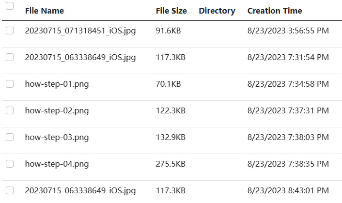
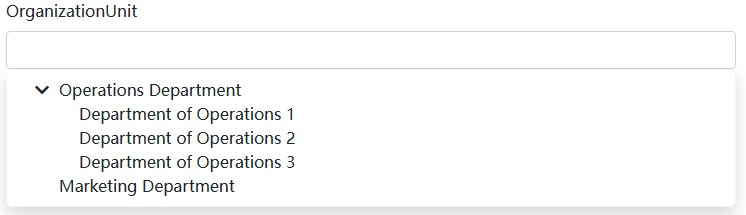

# BlazoriseUI 组件

基于 [Blazorise](https://blazorise.com) 开发的一系列 Blazor 组件，包含支持拖拽的树开组件、增强功能的DataGrid等组件。

## 安装

> 本项目依赖于`Volo.Abp.BlazoriseUI`项目，安装了本项目，则包含了[Volo.Abp.BlazoriseUI](https://github.com/abpframework/abp/tree/dev/framework/src/Volo.Abp.BlazoriseUI)的所有功能。

在 ABP 项目中，可以通过安装 `Dignite.Abp.BlazoriseUI` NuGet 包来使用这些组件。同时，需要将 `[DependsOn(typeof(DigniteAbpBlazoriseUiModule))]` 添加到项目的 ABP 模块依赖列表中。

## AutoHeight 组件

`<AutoHeight>` 组件 生成一个`<div>`元素，从插入该元素的位置开始，根据当前视窗高度计算该`<div>`元素充满剩余屏幕的高度。

如果内容素材的高度超出`<AutoHeight>` 组件 的高度，将出现滚动条。

### 基本用法

````html
<AutoHeight>
    <div>这是内部元素</div>
</AutoHeight>
````

### 带有 ExtraHeight 的 AutoHeight

为 `<AutoHeight>` 组件 设定 `ExtraHeight` 值，`<AutoHeight>` 组件的高度将减少 `ExtraHeight` 个像素。

````html
<AutoHeight ExtraHeight="45">
    <div>这是内部元素</div>
</AutoHeight>
````

## ExtensibleDataGrid 组件

`ExtensibleDataGrid` 组件简化了 `[Blazorise DataGrid](https://blazorise.com/docs/extensions/datagrid/getting-started)` 组件的使用方法，同时增加了自适应高度和编程式 `TableColumn` 等新特征。

>ExtensibleDataGrid 通常配合`[AbpCrudPageBase](https://github.com/abpframework/abp/blob/dev/framework/src/Volo.Abp.BlazoriseUI/AbpCrudPageBase.cs)`使用.

### 基本用法

```csharp
@inject ISiteAdminAppService SiteAdminAppService
@inherits AbpCrudPageBase<ISectionAdminAppService, SectionDto, Guid, GetSectionsInput, CreateSectionInput, UpdateSectionInput>
```

````html
<ExtensibleDataGrid TItem="SectionDto"
                    Data="@Entities"
                    ReadData="@OnDataGridReadAsync"
                    TotalItems="@TotalCount"
                    ShowPager="true"
                    PageSize="@PageSize"
                    CurrentPage="@CurrentPage"
                    Columns="@SectionManagementTableColumns">
</ExtensibleDataGrid>
````

````csharp
public partial class SectionManagement
{
    protected List<TableColumn> SectionManagementTableColumns => TableColumns.Get<SectionManagement>();
    
    protected override ValueTask SetTableColumnsAsync()
    {
        SectionManagementTableColumns
            .AddRange(new TableColumn[]
            {
                new TableColumn
                {
                    Title = L["DisplayName"],
                    Data = nameof(SectionDto.DisplayName)
                },
                new TableColumn
                {
                    Title = L["Name"],
                    Data = nameof(SectionDto.Name)
                },
                new TableColumn
                {
                    Title = L["Route"],
                    Data = nameof(SectionDto.Route)
                },
                new TableColumn
                {
                    Title = L["Template"],
                    Sortable = true,
                    Data = nameof(SectionDto.Template)
                }
            });

        return base.SetTableColumnsAsync();
    }
}
````

### SelectionMode

`SelectionMode`支持 `Multiple?DataGridSelectionMode.Single` 和 `Multiple?DataGridSelectionMode.Multiple` 两种方式，默认值为`Multiple?DataGridSelectionMode.Single`。

如果将`SelectionMode`设置为`Multiple?DataGridSelectionMode.Multiple`，行记录前面将出现复选框。



获取选中的记录

````html
<ExtensibleDataGrid TItem="SectionDto" @ref="DataGridRef"
                    SelectionMode="Multiple?DataGridSelectionMode.Multiple: DataGridSelectionMode.Single"
                    Data="Entities"
                    ReadData="OnDataGridReadAsync"
                    TotalItems="TotalCount"
                    ShowPager="true"
                    PageSize="PageSize"
                    CurrentPage="@CurrentPage"
                    Columns="@SectionManagementTableColumns">
</ExtensibleDataGrid>
<Button Color="Color.Primary" Clicked="SelectSectionsAsync">选择记录</Button>
````

````csharp
public partial class SectionManagement
{        
    protected virtual async Task SelectSectionsAsync()
    {
        var items = DataGridRef.SelectedItems;
    }
}
````

### API

以下是`ExtensibleDataGrid` 组件的所有属性：

* `TItem` : 指定数据类型。
* `Data` : `TItem` 指定类型的数据列表。
* `ReadData` ：读取数据列表的异步方法。如果页面继承自`AbpCrudPageBase`类，则可以直接使用`OnDataGridReadAsync`方法。
* `TotalItems`：指定数据总数。
* `ShowPager` : 指定是否显示分页导航。
* `CurrentPage` : 指定数据分页中的当前页。
* `Columns`：指定`[TableColumn](https://github.com/abpframework/abp/blob/dev/framework/src/Volo.Abp.AspNetCore.Components.Web/Volo/Abp/AspNetCore/Components/Web/Extensibility/TableColumns/TableColumn.cs)`列表。
* `SelectionMode`：指定选择数据的方式，支持 `Multiple?DataGridSelectionMode.Single` 和 `Multiple?DataGridSelectionMode.Multiple` 两种方式，默认值为`Multiple?DataGridSelectionMode.Single`。
* `ExtraHeight`：指定`ExtensibleDataGrid`的额外高度，用于开发者控制`ExtensibleDataGrid`的自适应高度。

## PasswordEdit 组件

`PasswordEdit`组件是`<TextEdit Role="TextRole.Password"></TextEdit>`的封装，增加了可显示密码明文的切换功能以及随机生成新密码的功能。


### 基本用法

````html
<PasswordEdit @bind-Password="NewPassword"></PasswordEdit>
````

### API

以下是`PasswordEdit` 组件的所有属性：

* `Password` : 获取或设置输入框内的密码。
* `PasswordChanged` : 密码更改后触发事件回调。
* `Length` : 设置随机生成密码的长度。（默认值：6）
* `Characters` : 设置随机生成的密码设置字符。（默认值：ABCDEFGHIJKLMNOPQRSTUVWXYZabcdefghizklmnopqrstuvwxyz_-{}[]!@#$%^&*();'=+<>,.|?0123456789）
* `Validator` : 用于验证选中值的验证处理程序。
* `AsyncValidator` : 异步验证所选值。

## ExtensibleTreeView 组件

`ExtensibleTreeView` 组件是 `[Blazorise TreeView](https://blazorise.com/docs/extensions/treeview)` 组件的封装，保留其原有功能，增加了拖拽功能。

### 基本用法

````html
<ExtensibleTreeView TNode="Item" Nodes="Items" Draggable
          GetChildNodes="@(item => item.Children)"
          HasChildNodes="@(item => item.Children?.Any() == true)"
          @bind-SelectedNode="selectedNode"
          @bind-ExpandedNodes="expandedNodes"
          NodeDropped="@OnDroped">
    <NodeContent>
        <Icon Name="IconName.Folder" />
        @context.Text
    </NodeContent>
</ExtensibleTreeView>
````

````csharp
@code{
    public class Item
    {
        public string Text { get; set; }
        public IEnumerable<Item> Children { get; set; }
    }

    IEnumerable<Item> Items = new[]
    {
        new Item { Text = "Item 1" },
        new Item
        {
            Text = "Item 2",
            Children = new []
            {
                new Item { Text = "Item 2.1" },
                new Item
                {
                    Text = "Item 2.2",
                    Children = new []
                    {
                        new Item { Text = "Item 2.2.1" },
                        new Item { Text = "Item 2.2.2" },
                        new Item { Text = "Item 2.2.3" },
                        new Item { Text = "Item 2.2.4" }
                    }
                },
                new Item { Text = "Item 2.3" },
                new Item { Text = "Item 2.4" }
            }
        },
        new Item { Text = "Item 3" },
    };

    IList<Item> expandedNodes = new List<Item>();
    Item selectedNode;

    
    protected virtual async void OnDroped(DropNode<Item> dropNode)
    {
        if (dropNode.Node.Id == dropNode.Target.Id)
            return;

        if(dropNode.Area==DragEnterNodePosition.Inside)
        {
            // Drag and drop inside the target node
        }
        else if (position == DragEnterNodePosition.Bottom)
        {
            // Drag and drop below the target node
        }

        await this.InvokeAsync(() => this.StateHasChanged());
    }
}
````

### API

以下是`ExtensibleTreeView` 组件的属性：

* `Nodes` : 绑定到组件的节点列表。
* `NodeContent` : 显现节点内容的模板。
* `SelectedNode` : 当前选中的节点。
* `SelectedNodeChanged` : 选中节点发生变化时触发事件回调。
* `ExpandedNodes` : 当前展开的子节点列表。
* `ExpandedNodesChanged` : 当扩展节点集合发生变化时触发事件回调。
* `GetChildNodes` : 获取节点的子节点列表。
* `HasChildNodes` : 判断节点是否有子元素。
* `Draggable` : 是否启用拖拽功能。（默认值：false）
* `NodeDropped` : 拖拽节点后触事件回调。

## TreeSelect 组件

TreeSelect 组件是一个下拉式树形选择组件。



### 基本用法

````html
<TreeSelect TNode="Item" TValue="string"
            Nodes="@Items"
            SelectedNodeChanged="OnSelectNodeChanged"
            GetChildNodes="@(item => item.Children)"
            HasChildNodes="@(item => item.Children?.Any() == true)"
            NodeText="x=>x.Text">
</TreeSelect>
````

````csharp
@code{
    public class Item
    {
        public string Text { get; set; }
        public IEnumerable<Item> Children { get; set; }
    }

    IEnumerable<Item> Items = new[]
    {
        new Item { Text = "Item 1" },
        new Item
        {
            Text = "Item 2",
            Children = new []
            {
                new Item { Text = "Item 2.1" },
                new Item
                {
                    Text = "Item 2.2",
                    Children = new []
                    {
                        new Item { Text = "Item 2.2.1" },
                        new Item { Text = "Item 2.2.2" },
                        new Item { Text = "Item 2.2.3" },
                        new Item { Text = "Item 2.2.4" }
                    }
                },
                new Item { Text = "Item 2.3" },
                new Item { Text = "Item 2.4" }
            }
        },
        new Item { Text = "Item 3" },
    };

    
    protected virtual Task OnSelectNodeChanged(Item args)
    {        
        Console.WriteLine(args.Text);
        return Task.CompletedTask;
    }
}
````

### API

以下是`ExtensibleTreeView` 组件的属性：

* `Nodes` : 绑定到组件的节点列表。
* `SelectedNode` : 当前选中的节点。
* `SelectedNodeChanged` : 选中节点发生变化时触发事件回调。
* `ExpandedNodes` : 当前展开的子节点列表。
* `ExpandedNodesChanged` : 当扩展节点集合发生变化时触发事件回调。
* `ClearNode`：当清除选择的节点时触发事件回调。
* `GetChildNodes` : 获取节点的子节点列表。
* `HasChildNodes` : 判断节点是否有子元素。
* `NodeText` : 设定显示节点的文本
* `Validator` : 用于验证选中值的验证处理程序。
* `AsyncValidator` : 异步验证所选值。
