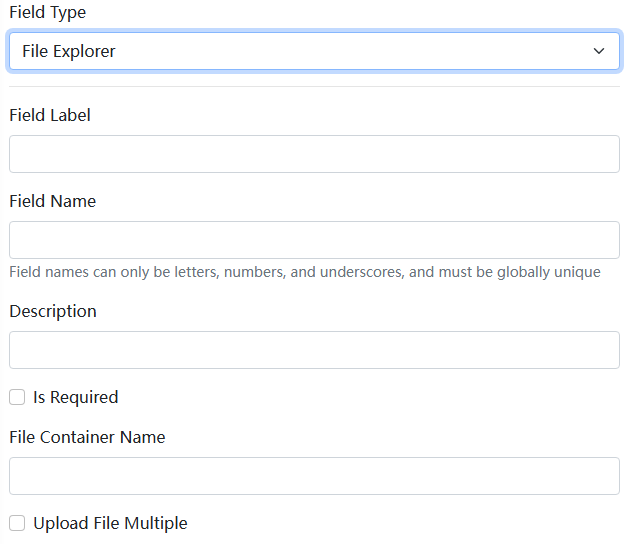

# Blazor 文件动态表单组件

文件动态表单组件是 [Dignite.Abp.DynamicForms](Dynamic-Forms.md) 模块的一部分，关于动态表单组件的开发信息请参阅 [Blazor 动态表单组件](Blazor-Dynamic-Form-Components.md)。

## 安装

要使用文件动态表单组件，请执行以下步骤：

1. 将 `Dignite.Abp.DynamicForms.FileExplorer` NuGet 包安装到 `Application Layer` 中的 `Contracts` 项目中。

2. 在 [模块类](https://docs.abp.io/en/abp/latest/Module-Development-Basics) 的 `[DependsOn(...)]` 属性列表中添加 `AbpDynamicFormsFileExplorerModule`。

3. 将 `Dignite.Abp.DynamicForms.Components.FileExplorer` NuGet 包安装到 Blazor 项目中。

4. 在 [模块类](https://docs.abp.io/en/abp/latest/Module-Development-Basics) 的 `[DependsOn(...)]` 属性列表中添加 `AbpDynamicFormsComponentsFileExplorerModule`。

以下是文件动态表单在 [Dignite CMS](https://dignite.com/dignite-cms) 后台配置的截图：

