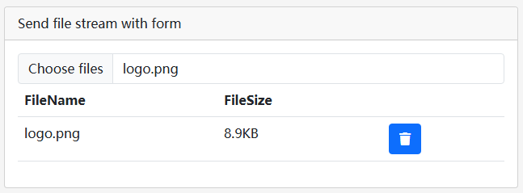
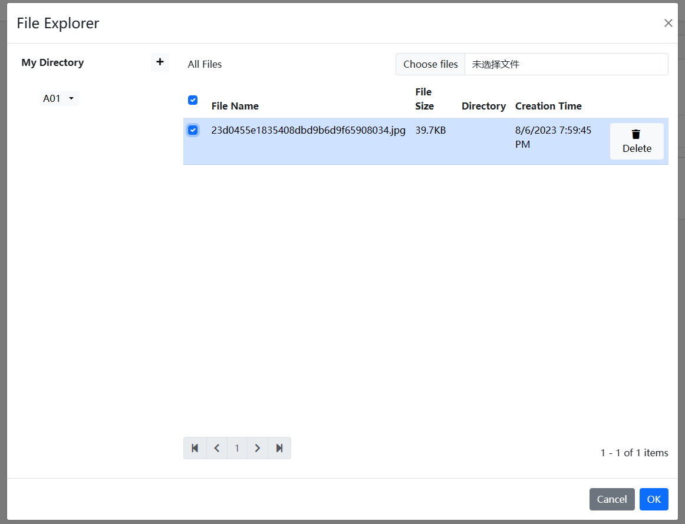

# 文件管理器

````json
//[doc-params]
{
    "DB": ["EF", "Mongo"]
}
````

文件管理器是ABP框架的一个应用程序模块，用于上传文件、记录文件信息。

> 目前只有 Blazor 版本

## 安装

- 将 `Dignite.FileExplorer.Domain.Shared` Nuget 包安装到 `Domain.Shared` 项目中

    添加 `FileExplorerDomainSharedModule` 到 [模块类](https://docs.abp.io/en/abp/latest/Module-Development-Basics) `[DependsOn(...)]`属性列表中。

- 将 `Dignite.FileExplorer.Domain` Nuget 包安装到 Domain 项目中

    添加 `FileExplorerDomainModule` 到 [模块类](https://docs.abp.io/en/abp/latest/Module-Development-Basics) `[DependsOn(...)]`属性列表中。

{{if DB == "EF"}}

- 将 `Dignite.FileExplorer.EntityFrameworkCore` Nuget 包安装到 EntityFrameworkCore 项目中

    添加 `FileExplorerEntityFrameworkCoreModule` 到 [模块类](https://docs.abp.io/en/abp/latest/Module-Development-Basics) `[DependsOn(...)]`属性列表中。

    添加 `builder.ConfigureFileExplorer()` 到 `OnModelCreating()` 方法中:

    ```csharp
    protected override void OnModelCreating(ModelBuilder modelBuilder)
    {
        base.OnModelCreating(modelBuilder);

        modelBuilder.ConfigurePermissionManagement();
        modelBuilder.ConfigureSettingManagement();
        modelBuilder.ConfigureAuditLogging();
        modelBuilder.ConfigureIdentity();
        modelBuilder.ConfigureFeatureManagement();
        modelBuilder.ConfigureTenantManagement();
        modelBuilder.ConfigureFileExplorer(); //Add this line to configure the FileExplorer Module
    }
    ```

    打开 Visual Studio 的 包管理控制台 选择 `DbMigrations` 做为默认项目. 然后编写以下命令为文档模块添加迁移.

    ```csharp
    add-migration Added_FileExplorer_Module
    ```

    现在更新数据库

    ```csharp
    update-database
    ```

{{end}}

{{if DB == "Mongo"}}

- 将 `Dignite.FileExplorer.MongoDB` Nuget 包安装到 MongoDB 项目中

    添加 `FileExplorerEntityMongoDBModule` 到 [模块类](https://docs.abp.io/en/abp/latest/Module-Development-Basics) `[DependsOn(...)]`属性列表中。

    添加 `builder.ConfigureFileExplorer()` 到 `OnModelCreating()` 方法中:

    ```csharp
    protected override void OnModelCreating(ModelBuilder modelBuilder)
    {
        base.OnModelCreating(modelBuilder);

        modelBuilder.ConfigurePermissionManagement();
        modelBuilder.ConfigureSettingManagement();
        modelBuilder.ConfigureAuditLogging();
        modelBuilder.ConfigureIdentity();
        modelBuilder.ConfigureFeatureManagement();
        modelBuilder.ConfigureTenantManagement();
        modelBuilder.ConfigureFileExplorer(); //Add this line to configure the FileExplorer Module
    }
    ```

{{end}}

- 将 `Dignite.FileExplorer.Application.Contracts` Nuget 包安装到 Application.Contracts 项目中

    添加 `FileExplorerApplicationContractsModule` 到 [模块类](https://docs.abp.io/en/abp/latest/Module-Development-Basics) `[DependsOn(...)]`属性列表中。

- 将 `Dignite.FileExplorer.Application` Nuget 包安装到 Application 项目中

    添加 `FileExplorerApplicationModule` 到 [模块类](https://docs.abp.io/en/abp/latest/Module-Development-Basics) `[DependsOn(...)]`属性列表中。

- 将 `Dignite.FileExplorer.HttpApi` Nuget 包安装到 HttpApi 项目中

    添加 `FileExplorerHttpApiModule` 到 [模块类](https://docs.abp.io/en/abp/latest/Module-Development-Basics) `[DependsOn(...)]`属性列表中。

## 配置文件网格

文件网格可以对容器分隔为多个单元格，方便将文件分单元格存储。

例如：一辆车的图片分为外观、内饰、其他三个单元格

````csharp
Configure<AbpBlobStoringOptions>(options =>
{
    options.Containers.Configure<CarPictureContainer>(container =>
    {        
        container.SetFileGridConfiguration(fg => fg.FileCells = new List<FileCell>
        {
            new FileCell("appearance",L("appearance")),               //外观
            new FileCell("interior",L("interior")),                   //内饰
            new FileCell("other",L("other")),                          //其他
        });
    });
});
````

## 配置图片处理器

本模块新增图片处理器，当上传的图片宽度或高度超出配置的尺寸时，处理器自动压缩图片的宽度和高度。

在`ConfigureServices` 方法中配置允许上传的文件类型：

````csharp
Configure<AbpBlobStoringOptions>(options =>
{
    options.Containers.Configure<ProfilePictureContainer>(container =>
    {
        container.AddImageResizeHandler(handler =>
        {
            handler.ImageWidth = 256;
            handler.ImageHeight = 256;
        });
    });
});
````

## 配置文件管理权限

通过配置权限，约束用户对文件的访问。

在 `Application` 项目中 `ConfigureServices` 方法中配置允许上传的文件类型：

````csharp
Configure<AbpBlobStoringOptions>(options =>
{
    options.Containers.Configure<ProfilePictureContainer>(container =>
    {
        container.SetAuthorizationConfiguration(config =>
        {
            config.CreateDirectoryPermissionName = CmsAdminPermissions.Entry.Create;  //设置可以创建文件夹的权限
            config.CreateFilePermissionName = CmsAdminPermissions.Entry.Create;       //设置可以上传文件的权限
            config.UpdateFilePermissionName = CmsAdminPermissions.Entry.Update;       //设置可以修改文件信息的权限
            config.DeleteFilePermissionName = CmsAdminPermissions.Entry.Delete;       //设置可以删除文件的权限
        });
    });
});
````

### 继承用户访问业务对象的策略授权

在很多情况下文件是隶属某业务对象，用户对该业务对象拥有访问权才可以访问业务对象的文件。

1. 配置授权策略
   参照 [ASP.NET Core 中基于策略的授权](https://learn.microsoft.com/en-us/aspnet/core/security/authorization/policies) 开发业务对象授权的程序。

2. 对接文件管理的策略授权
   继承`FileDescriptorEntityAuthorizationHandlerBase`抽象类，重写 `GetResourceAsync` 方法：

   ```csharp
   public class EntryResourceAuthorizationHandler : FileDescriptorEntityAuthorizationHandlerBase<Entry>, ITransientDependency
    {
        private readonly IRepository<Entry, Guid> _entryRepository;

        public EntryResourceAuthorizationHandler(IRepository<Entry, Guid> entryRepository)
        {
            _entryRepository = entryRepository;
        }

        public override async Task<Entry> GetResourceAsync(FileDescriptor file)
        {
            var entryId = Guid.Parse(file.EntityId);
            var entry = await _entryRepository.GetAsync(entryId,false);
            return entry; 
        }
    }
   ```

    在 `Application` 项目中 `ConfigureServices` 方法中如下配置：

    ````csharp
    Configure<AbpBlobStoringOptions>(options =>
    {
        options.Containers.Configure<ProfilePictureContainer>(container =>
        {
            container.SetAuthorizationConfiguration(config =>
            {
                config.CreateDirectoryPermissionName = CmsAdminPermissions.Entry.Create;  //设置可以创建文件夹的权限
                config.CreateFilePermissionName = CmsAdminPermissions.Entry.Create;       //设置可以上传文件的权限
                config.UpdateFilePermissionName = CmsAdminPermissions.Entry.Update;       //设置可以修改文件信息的权限
                config.DeleteFilePermissionName = CmsAdminPermissions.Entry.Delete;       //设置可以删除文件的权限
                config.SetAuthorizationHandler<EntryResourceAuthorizationHandler>(); 
            });
        });
    });
    ````

## BlobName 生成器

默认情况下，BlobName为新生成的Guid值，通过继承`IBlobNameGenerator`接口，可以按你的规则生成BlobName。示例：

```csharp
public class YearMonthBlobNameGenerator : IBlobNameGenerator, ITransientDependency
{
    public Task<string> Create()
    {
        return Task.FromResult(
            DateTime.Now.Year.ToString() + "/" + DateTime.Now.Month.ToString() + "/" + Guid.NewGuid().ToString("N")
            );
    }
}
```

在 `Application` 项目中 `ConfigureServices` 方法中如下配置：

````csharp
Configure<AbpBlobStoringOptions>(options =>
{
    options.Containers.Configure<ProfilePictureContainer>(container =>
    {
        container.SetBlobNameGenerator<YearMonthBlobNameGenerator>();
    });
});
````

## HttpApi层

### FileDescriptorController

- `上传文件`
  接口地址：api/file-explorer/files
  Http方法：post
  
- `更新文件信息`
  接口地址：api/file-explorer/files
  Http方法：put

- `删除文件`
  接口地址：api/file-explorer/files/{id}
  Http方法：delete

- `获取文件信息`
  接口地址：api/file-explorer/files/{id}
  Http方法：get
  
- `获取文件列表`
  接口地址：api/file-explorer/files
  Http方法：get
  
- `获取容器配置`
  接口地址：api/file-explorer/files/configuration
  Http方法：get

- `下载文件`
  接口地址：api/file-explorer/files/download/{containerName}/{*blobName}
  Http方法：get

- `获取文件流`
  接口地址：api/file-explorer/files/{containerName}/{*blobName}
  Http方法：get
  裁切图片的参数：在api url中指定返回图片的宽度和高度，例如：api/file-explorer/files/{containerName}/{*blobName}?Width=600&Height=400

## 适用于Blazor的文件上传组件

### 文件上传组件

用户选择文件后不会马上上传文件到服务器，当提交整个表单时，一起提交到服务器端。


- 基于用法

    ````html
    <FileEditComponent ContainerName="@ProfilePictureContainer.ContainerName" Multiple="true">
    </FileEditComponent>
    ````

- 指定关联的实体

    ````html
    <FileEditComponent ContainerName="@ProfilePictureContainer.ContainerName" Multiple="true" EntityId="7c804a75-665c-c575-13e5-3a07b0bbb0fe">
    </FileEditComponent>
    ````

- 组件属性介绍
  - ContainerName

    文件存储容器的名称。
    > 关于存储容器参见 [Typed IBlobContainer](https://docs.abp.io/en/abp/latest/Blob-Storing#typed-iblobcontainer)

  - CellName

    文件存储单元格的名称。

  - Multiple

    是否允许多选文件。

  - EntityId

    关联业务对象实体的编号。

  - FileDescriptors

    已上传的文件列表。

  - FileDescriptorsChanged

    已上传文件列表发生变化时触发的事件。

  - FileDescriptorsContent

    已上传文件列表呈现的 Blazor 模板
    > 关于 Blazor 模板请参见 [ASP.NET Core Blazor 模板化组件](https://learn.microsoft.com/zh-cn/aspnet/core/blazor/components/templated-components)

  - FileChanged

    选择文件后触发的事件。

  - FilesContent

    选择文件后呈现的 Blazor 模板
    > 关于 Blazor 模板请参见 [ASP.NET Core Blazor 模板化组件](https://learn.microsoft.com/zh-cn/aspnet/core/blazor/components/templated-components)

  - Validator

    用于文件组件的验证处理程序。

  - AsyncValidator

    文件组件的验证处理程序。

### 文件选择器组件

用户可以选择已往上传过的文件，也可以立即上传一个新文件。



- 基于用法

    ````html
    <FilePickerComponent ContainerName="@ProfilePictureContainer.ContainerName" Multiple="false">                        
    </FilePickerComponent>
    ````

- 指定关联的实体

    ````html
    <FilePickerComponent ContainerName="@ProfilePictureContainer.ContainerName" Multiple="true" EntityId="7c804a75-665c-c575-13e5-3a07b0bbb0fe">
    </FilePickerComponent>
    ````

- 组件属性介绍
  - ContainerName

    文件存储容器的名称。
    > 关于存储容器参见 [Typed IBlobContainer](https://docs.abp.io/en/abp/latest/Blob-Storing#typed-iblobcontainer)
    
  - CellName

    文件存储单元格的名称。

  - Multiple

    是否允许多选文件。

  - EntityId

    关联业务对象实体的编号。

  - FileDescriptors

    已上传的文件列表。

  - FileDescriptorsChanged

    已上传文件列表发生变化时触发的事件。

  - FileDescriptorsContent

    已上传文件列表呈现的 Blazor 模板
    > 关于 Blazor 模板请参见 [ASP.NET Core Blazor 模板化组件](https://learn.microsoft.com/zh-cn/aspnet/core/blazor/components/templated-components)

  - OpeningFileExplorerModal

    打开文件选择模态窗口时触发的事件。

  - Validator

    用于文件组件的验证处理程序。

  - AsyncValidator

    文件组件的验证处理程序。
