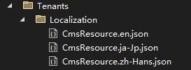
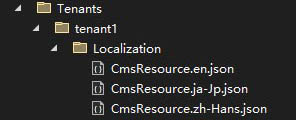

# 多租户本地化

在Razor视图/Page中每个租户都能有一套独立的本地化，一个典型的应用场景是用于网站设计，每一个租户的网站都可以使用一套本地化系统。

## Installation

* 将 `Dignite.Abp.Localization` NuGet 包安装到 Web 项目中。
* 添加 `DigniteAbpLocalizationModule` 到 [模块类](https://docs.abp.io/en/abp/latest/Module-Development-Basics) `[DependsOn(...)]`属性列表中.

## 创建一个本地化资源文件

在`/Localization/`目录下创建一个本地化资源文件类，并为该类添加`MultiTenancyLocalizationResourceName`属性，例如：

````C#
[MultiTenancyLocalizationResourceName("CmsResource")]
public class CmsResource
{
}
````

租主的 JSON 文件位于 `/Tenants/Localization/` 文件夹下，如下图所示：



租户的 JSON 文件位于 `/Tenants/{租户名称}/Localization/` 文件夹下，如下图所示：



JSON 本地化文件内容如下所示：

````json
{
  "HelloWorld": "Hello World!"
}
````

## 获取本地化文本

### 在类中的简单用法

只需注入 `IStringLocalizer<TResource>` 服务并如下所示使用即可：

````csharp
public class MyService : ITransientDependency
{
    private readonly IStringLocalizer<CmsResource> _localizer;

    public MyService(IStringLocalizer<CmsResource> localizer)
    {
        _localizer = localizer;
    }

    public void Foo()
    {
        var str = _localizer["HelloWorld"];
    }
}
````

### 在Razor 视图/Pages中使用

在Razor 视图/Pages中注入 `IStringLocalizer<TResource>` 服务：

````c#
@inject IStringLocalizer<CmsResource> _localizer

<h1>@_localizer["HelloWorld"]</h1>
````

### 格式化参数

格式参数可以在本地化键之后传递。如果您的信息是 `Hello {0}, welcome!`，那么您可以向本地化器传递`{0}`参数，如`_localizer["HelloMessage", "John"]`。

> 有关使用本地化的详细信息，请参阅 [微软本地化文档](https://docs.microsoft.com/en-us/aspnet/core/fundamentals/localization)。
