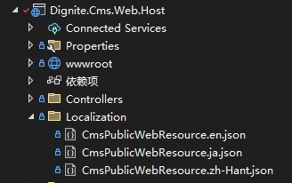

# 租户本地化

租户本地化允许每个租户拥有自己独立的本地化内容。这个功能非常适合用于网站设计等场景。

## 安装

1. 在您的 Web 项目中安装 `Dignite.Abp.TenantLocalization` NuGet 包。
2. 将 `AbpTenantLocalizationModule` 添加到您的 [模块类](https://docs.abp.io/zh-Hans/abp/latest/Module-Development-Basics) 的 `[DependsOn(...)]` 属性列表中。

## 创建本地化资源文件

在 `/Localization/` 目录下创建一个本地化资源文件类，并为该类添加 `TenantLocalizationResourceName` 属性，例如：

```csharp
[TenantLocalizationResourceName]
public class CmsPublicWebResource
{
}
```

租主的 JSON 本地化文件位于 `/Localization/` 文件夹下。



租户的 JSON 本地化文件位于 `/Tenants/{租户名称}/Localization/` 文件夹下，如下图所示：


JSON 本地化文件的内容如下所示：

```json
{
  "HelloWorld": "Hello World!"
}
```

## 获取本地化文本

### 在类中的简单用法

只需注入 `IStringLocalizer<TResource>` 服务并如下所示使用即可：

```csharp
public class MyService : ITransientDependency
{
    private readonly IStringLocalizer<CmsResource> _localizer;

    public MyService(IStringLocalizer<CmsResource> localizer)
    {
        _localizer = localizer;
    }

    public void Foo()
    {
        var str = _localizer["HelloWorld"];
    }
}
```

### 在 Razor 视图/Pages 中使用

在 Razor 视图/Pages 中注入 `IStringLocalizer<TResource>` 服务，如下所示：

```csharp
@inject IStringLocalizer<CmsResource> _localizer

<h1>@_localizer["HelloWorld"]</h1>
```

### 格式化参数

您可以在本地化键之后传递格式化参数。例如，如果您的消息是 `Hello {0}, welcome!`，您可以将 `{0}` 参数传递给本地化器，如 `_localizer["HelloMessage", "John"]`。

> 欲了解更多有关使用本地化的详细信息，请参阅 [微软本地化文档](https://docs.microsoft.com/zh-cn/aspnet/core/fundamentals/localization)。
