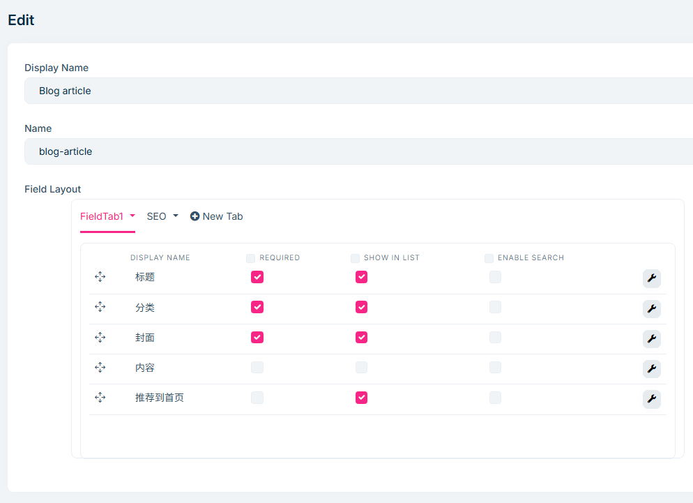

# Dignite Cms 基本概念

## 多语言配置

Dignite Cms 的多语言[区域化](../regionalization.md)模块实现，通过设置中的[区域化](../regional-management.md)管理网站支持的语言。

## 字段

Dignite Cms 字段基于 Dignite Abp [动态表单](https://learn.dignite.com/zh-Hans/abp/latest/Dynamic-Forms)模块实现，通过自定义的字段，满足页面灵活的展示需求。

### 简单字段

包括:文本框、下拉菜单、富文本编辑、日期选择、文件上传、数字框等类型

### 复杂字段

除了简单类型的字段外，Dignite Cms还提供了三种复杂表单类型：

- 条目：配置条目列表的数据源，供用户选择条目
- 矩阵：通过配置矩阵块，实现丰富的结构化内容管理
- 表格：通过配置表格格式，规范表格化数据的输入

> 欲了解表单的使用，请通过快速入门教程，在后台管理中体验。

## 版块

版块是一个网站的骨架，用于将网站内容分区。

- 版块类型：包括单页类型、结构类型和频道类型三种类型
  
  - 单页类型：适用于首页、产品索引页等聚合页面，每个版块中同一条目类型的条目只能有一条
  - 结构类型：适用于条目数量不多的版块，支持手动排序和多层级结构，比如常见问题解答、服务项目等
  - 频道类型：适用于不断新增条目的场景，比如新闻版块

- 显示名称：版块的显示文本
- 名称：版块的唯一名称
- 条目路由：版块下条目的访问路由
- 页面模板：条目的视图页面路径，不需要包含.cshtml后缀
- 默认：用于指定站点的默认版块，仅适用于单页类型版块
- 激活：开启或禁止用户对该版块的访问
  
## 条目类型

版块中的条目可以以多种形式存在，比如博客版块的帖子可以是图文、视频或者画廊形式。每一种条目类型都可以配置不同的字段，满足前端UI需求。

- 显示名称：条目类型的显示文本
- 名称：条目类型在版块下的唯一名称
- 字段布局：字段可以分布在多个Tab中布局，并且支持设置字段标签、是否必填以及是否加入列表

## 条目

条目是网站页面中的内容，内容由字段构成。

条目隶属于某个版块，支持多语言和多版本特性。

- 字段：条目的数据
- 别名：版块中条目的唯一名称
- 版本：每个条目可以创建多个版本，只有一个激活版本
- 修订说明：记录条目版本的说明