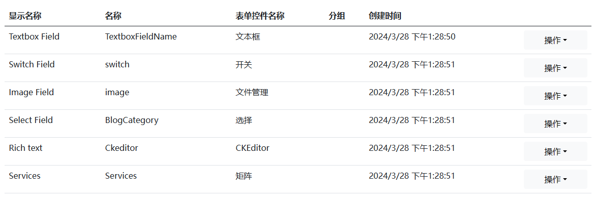

# Dignite Cms后台系统启动指南

Dignite Cms的后台管理基于Blazor和Angular两套技术框架，本文档以Blazor环境讲解。

> 基于 Angular 技术的后台管理功能更加丰富，熟悉 Angular 技术的用户可选择运行 Angular 后台管理系统。
> 虽然 Blazor 的技术在不断成熟，但技术本身的原生问题导致在浏览器中的性运行能不如Angular，基于 Blazor 技术的后台管理系统将在下一版本中移除

以下是启动后台系统的详细步骤：

````json
//[doc-params]
{
    "UI": ["Blazor","BlazorServer"]
}
````

{{if UI == "Blazor"}}

## 使用Blazor WebAssembly方式启动

1. **启动IdentityServer**

    在终端中，进入`host\Dignite.Cms.IdentityServer`目录，并执行以下命令：

    ```bash
    dotnet ef database update
    ```

    ```bash
    dotnet run
    ```

2. **启动HttpApi.Host**

    在终端中，进入`host\Dignite.Cms.HttpApi.Host`目录，并执行以下命令：

    ```bash
    dotnet ef database update
    ```

    ```bash
    abp install-libs
    ```

    ```bash
    dotnet run
    ```

    > 第一次运行时，系统将自动创建种子数据。

3. **启动Blazor.Host**

    在终端中，进入`host\Dignite.Cms.Blazor.Host`目录，并执行以下命令：

    ```bash
    dotnet run
    ````

    在浏览器中访问`https://localhost:44307`地址即可进入Dignite Cms后台。

    > 初始账号： admin
    >
    > 初始密码： 1q2w3E*

4. **启动MVC网站**

    在终端中，进入`host\Dignite.Cms.Web.Host`目录，并执行以下命令：

    ```bash
    abp install-libs
    ```

    ```bash
    dotnet run
    ```

    在浏览器中访问`https://localhost:44339`地址即可进入Dignite Cms MVC网站。

{{end}}

{{if UI == "BlazorServer"}}

## 使用Blazor Server方式启动

在终端中，进入`host\Dignite.Cms.Blazor.Server.Host`目录，并执行以下命令：

```bash
dotnet ef database update
```

```bash
dotnet run
```

在浏览器中访问`https://localhost:44361`地址即可进入Dignite Cms后台。

{{end}}

## 功能概览

### 字段

字段用于自定义条目的字段。



### 版块

版块是网站的骨架，用于支撑条目的结构。


### 条目类型管理

条目类型用于定义版块中多种类型的条目。


### 条目管理

条目是网站页面的内容，支持多语言和多版本特性。


