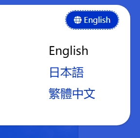

# MVC Website Development Basics

This document introduces the fundamental knowledge of developing MVC websites based on Dignite Cms.

## Public Application Layer

### ISiteSettingsPublicAppService

### API

- `Task<string> GetDefaultLanguageAsync()`

    Gets the default language of the website.

- `Task<IEnumerable<string>> GetAllLanguagesAsync()`
  
    Gets all languages of the website.

- `Task<BrandDto> GetBrandAsync()`

    Gets the brand information of the website.

    The `Dignite.Cms.Web.Host\CmsBrandingProvider.cs` file demonstrates how to get the brand information of the website.

### IFieldPublicAppService

#### API

- `Task<FieldDto> FindByNameAsync(string name)`:

    Find a field by its name. Returns the field information if found, otherwise returns `null`.

#### Properties of `FieldDto`

- `Id`: The unique identifier of the field.
- `Name`: The unique name of the field.
- `DisplayName`: The display name of the field.
- `Description`: The description of the field.
- `FormControlName`: The name of the field control.
- `FormConfiguration`: The configuration of the field control.

### ISectionPublicAppService

#### API

- `Task<SectionDto> GetAsync(Guid id)`:

    Get the section information by id. Returns the section information if found, otherwise throws an exception.

- `Task<SectionDto> FindByNameAsync(string name)`:

    Find a section by its name. Returns the section information if found, otherwise returns `null`.

- `Task<SectionDto> FindByRouteAsync(string route)`:

    Find a section by its entry path (i.e., match the entry URL). Returns the section information if found, otherwise returns `null`.

- `Task<SectionDto> GetDefaultAsync()`:

    Get the default section.

#### Properties of `SectionDto`

- `Id`: The unique identifier of the section.
- `Name`: The unique name of the section.
- `DisplayName`: The display name of the section.
- `IsActive`: Indicates whether the section is active.
- `Type`: The type of the section (refer to [Sections](basic-concept.md#sections) for details).
- `Route`: The URL route of the entries under the section.
- `Template`: The view template for displaying entries.
- `EntryTypes`: The list of entry types in the section.

#### Extension Methods of `SectionDto`

- `FieldDto GetField(Guid entryTypeId, string name)`: Get the field with the specified name.

### IEntryPublicAppService

#### API

- `Task<EntryDto> FindBySlugAsync(FindBySlugInput input)`:

    Find an entry by its slug. Returns the entry information if found, otherwise returns `null`.

    The `input` parameter contains three query conditions:
  - `SectionId`: The section Id (required).
  - `Slug`: The slug of the entry (required).
  - `Culture`: The culture of the entry, with the default value being the default language of the site.

- `Task<EntryDto> GetAsync(Guid id)`:

    Get the entry by its id. Returns the entry information if found, otherwise throws an exception.

- `Task<EntryDto> FindPrevAsync(Guid id)`:

    Find the previous entry published before the specified `id`. Returns the entry information if found, otherwise returns `null`.

- `Task<EntryDto> FindNextAsync(Guid id)`:

    Find the next entry published after the specified `id`. Returns the entry information if found, otherwise returns `null`.

- `Task<PagedResultDto<EntryDto>> GetListAsync(GetEntriesInput input)`:

    Get a list of entries that meet the specified criteria.

    The `input` parameter contains the following query conditions:
  - `SectionId`: The section Id (required).
  - `Culture`: The culture of the entry, with the default value being the default language of the site.
  - `EntryTypeId`: The entry type Id.
  - `CreatorId`: The Id of the creator.
  - `StartPublishDate`: The start publish date.
  - `ExpiryPublishDate`: The expiry publish date.
  - `Filter`: The filter string in the entry title.
  - `QueryingByFieldsJson`: Query entries by field values (refer to [Advanced Development](advanced-development.md#querying-entries-by-field-values) for details).

  In addition to querying entries based on the above conditions, it also supports querying the list by entry Id array:
  - `SectionId`: The specified section Id (required).
  - `EntryIds`: The specified entry Id or Ids.

#### Properties of `EntryDto`

- `Id`: The unique identifier of the entry.
- `CreatorId`: The unique identifier of the creator.
- `SectionId`: The unique identifier of the section to which the entry belongs.
- `EntryTypeId`: The unique identifier of the entry type.
- `Culture`: The cultural region of the entry.
- `Title`: The title of the entry.
- `Slug`: The slug of the entry.
- `ParentId`: The unique identifier of the parent entry.
- `Order`: The order of the entry in the section.
- `Status`: The publish status of the entry, including `Draft` and `Published`.
- `PublishTime`: The publish time of the entry.
- `IsActivatedVersion`: Indicates whether it is the activated version of the entry.

#### Extension Methods of `EntryDto`

- `GetUrl(SectionDto section)`: Get the URL of the entry.

## MVC Controllers

### EntryController

The `EntryController` contains the following actions:

- `HomePage()`

  Find the entry with the slug `Index` under the default section and pass the `EntryViewModel` view model to the template page.

  For example, for the `Home Page` section in [Quick Start](quick-start.md), accessing `https://localhost:44339` will retrieve the entry with the language `en` and the slug `index` under the `Home Page` section and render the page using the `/Views/Entry/HomePage.cshtml` view.

- `EntryPageWithCulture(string culture, string route)`

  Find the entry with the specified `Culture` and matching `route` value, and pass the `EntryViewModel` view model to the template page.

  For example, for the `Blog Post` section in [Quick Start](quick-start.md), accessing `https://localhost:44339/ja/blog/2024/03/first-blog-post` will retrieve the entry

 with the language `ja` and the slug `first-blog-post` under the `Blog Post` section and render the page using the `/Views/Entry/Blog/Entry.cshtml` view.

- `EntryPage(string route)`

  Find the entry with the matching `route` value and pass the `EntryViewModel` view model to the template page.

  For example, for the `Blog Home` section in [Quick Start](quick-start.md), accessing `https://localhost:44339/blog` will retrieve the entry with the language `en` and the slug `index` under the `Blog Home` section and render the page using the `/Views/Entry/Blog/Index.cshtml` view.

The `EntryViewModel` class contains the following two properties:

- `Entry`: The entry of type `EntryDto`.
- `Section`: The section of type `SectionDto`.

## Localization

Dignite Cms Mvc websites support independent localization for each tenant, using `CmsPublicWebResource.{culture}.json` files to store localization resources.

Localization resource files for the tenant are stored in the `/Tenants/{TenantName}/Localization/` directory:


For information on how to use the multi-tenant localization feature, please refer to the [Multi-Tenant Localization](https://learn.dignite.com/zh-Hans/abp/latest/Localization-MultiTenancy) document.

## View Components

### Localization Switch Component

The `CultureSwitchViewComponent` component is used to switch localization.



Create a class that implements the `IToolbarContributor` interface and add the following code:

```csharp
public class CmsWebHostToolbarContributor : IToolbarContributor
{
    public virtual Task ConfigureToolbarAsync(IToolbarConfigurationContext context)
    {
        if (context.Toolbar.Name != StandardToolbars.Main)
        {
            return Task.CompletedTask;
        }

        context.Toolbar.Items.Add(new ToolbarItem(typeof(CultureSwitchViewComponent)));

        return Task.CompletedTask;
    }
}
```

Add the following code to the `ConfigureServices` method in the module class:

```csharp
Configure<AbpToolbarOptions>(options =>
{
    options.Contributors.Add(new CmsWebHostToolbarContributor());
});
```
