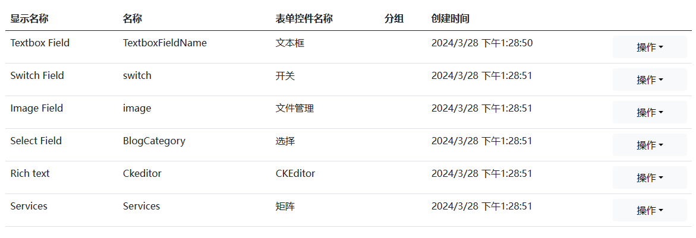
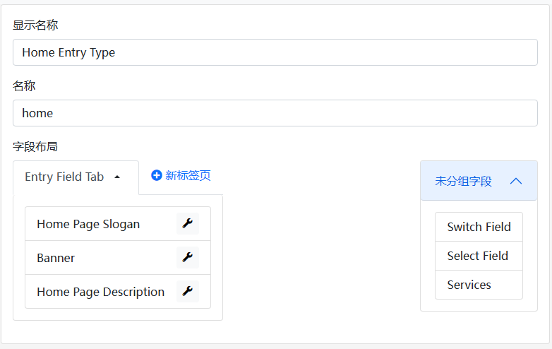
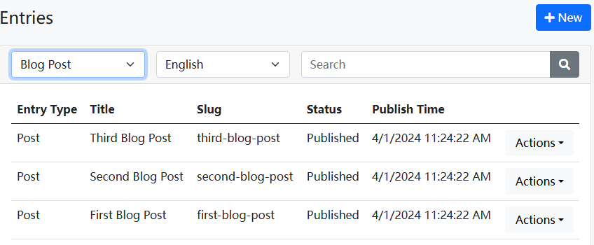
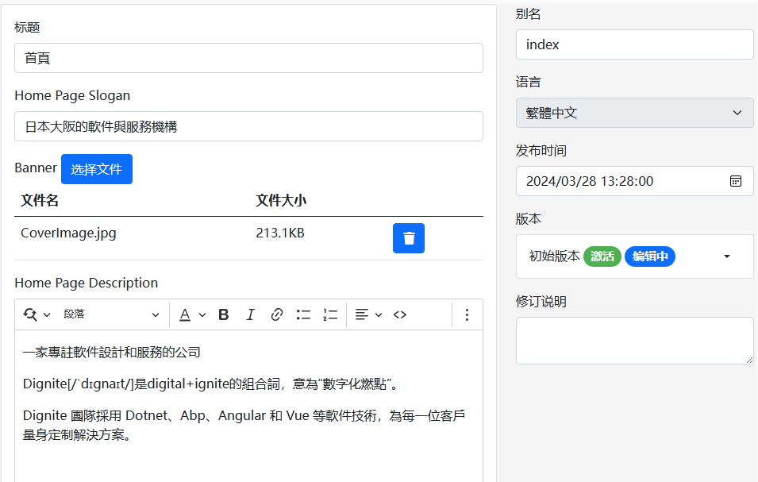

# Dignite Cms Admin System Startup Guide

The Dignite Cms admin system is based on Blazor technology, providing two running modes: Blazor WebAssembly and Blazor Server. Below are the detailed steps to start the admin system:

````json
//[doc-params]
{
    "UI": ["Blazor","BlazorServer"]
}
````

{{if UI == "Blazor"}}

## Start with Blazor WebAssembly

1. **Start IdentityServer**

    In the terminal, navigate to the `host\Dignite.Cms.IdentityServer` directory and execute the following commands:

    ```bash
    dotnet ef database update
    ```

    ```bash
    dotnet run
    ```

2. **Start HttpApi.Host**

    In the terminal, navigate to the `host\Dignite.Cms.HttpApi.Host` directory and execute the following commands:

    ```bash
    dotnet ef database update
    ```

    ```bash
    abp install-libs
    ```

    ```bash
    dotnet run
    ```

    > Seed data will be automatically created when running for the first time.

3. **Start Blazor.Host**

    In the terminal, navigate to the `host\Dignite.Cms.Blazor.Host` directory and execute the following command:

    ```bash
    dotnet run
    ````

    Access the Dignite Cms admin system by visiting the `https://localhost:44307` address in your browser.

    > Initial username: admin
    >
    > Initial password: 1q2w3E*

4. **Start MVC Website**

    In the terminal, navigate to the `host\Dignite.Cms.Web.Host` directory and execute the following command:

    ```bash
    abp install-libs
    ```

    ```bash
    dotnet run
    ```

    Access the Dignite Cms MVC website by visiting the `https://localhost:44339` address in your browser.

{{end}}

{{if UI == "BlazorServer"}}

## Start with Blazor Server

In the terminal, navigate to the `host\Dignite.Cms.Blazor.Server.Host` directory and execute the following commands:

```bash
dotnet ef database update
```

```bash
dotnet run
```

Access the Dignite Cms admin system by visiting the `https://localhost:44361` address in your browser.

{{end}}

## Overview of Features

### Field Management

Fields are used to define the properties of entries, and the system provides some preset fields for convenience.



### Section Management

Sections are the backbone of the site, used to support the structural layout of entries, and the system automatically creates some commonly used sections.


### Entry Type Management

Entry types are used to define which fields are applied to entries under sections, and multiple entry types can be configured for each section.



### Entry Management

Entries are the content of various sections on the website, supporting multi-language and multi-version features.




