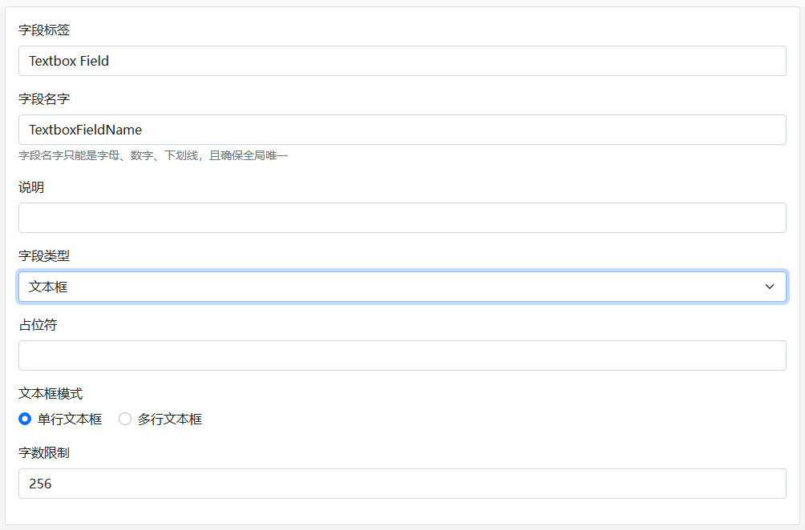
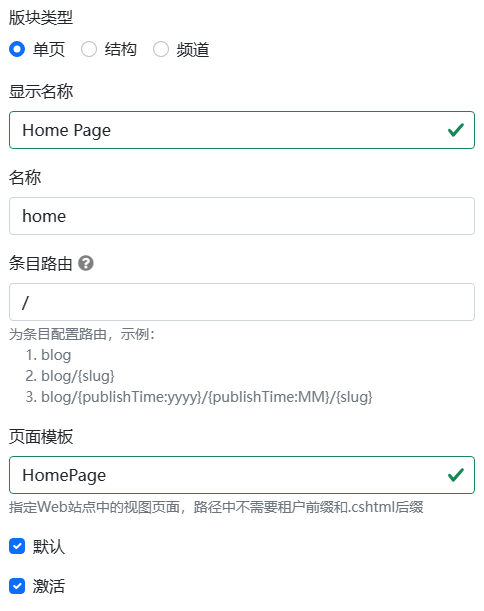

# Dignite Cms基本概念

## サイト設定

Dignite Cmsの設定は[Abp Settings](https://abp.io/docs/latest/framework/infrastructure/settings)モジュールに基づいており、マスターサイトとテナントサイトの言語とブランド情報を設定します。

以下はマスターサイトの基本設定の例です：

```json
"Settings": {
  "Abp.Localisation.DefaultLanguage": "en",
  "CmsSettings.Site.Languages": "en,ja,zh-Hant",
  "CmsSettings.Site.Name": "My Dignite",
  "CmsSettings.Site.LogoUrl":"/images/logo.png",
  "CmsSettings.Site.LogoReverseUrl":"/images/logo-reverse.png"
}
```

テナントの設定については、[設定管理](https://abp.io/docs/latest/modules/setting-management)のドキュメントを参照してください。

## フィールド

Dignite CMSのフィールドは、Dignite ABPで[ダイナミックフォーム](https://learn.dignite.com/zh-Hans/abp/latest/Dynamic-Forms)を使用して実装されています。これにより、開発者はさまざまなフロントエンドコンテンツ表示ニーズに応じてオンラインでフィールドを定義できます。

**テキスト編集フィールドの例:**



一般的なプロパティ:

- フィールドラベル: フィールドの表示テキスト。
- フィールド名: フィールドのユニークな識別子。
- フィールドの説明: フィールドの説明テキスト。
- フィールドタイプ: テキストボックス、ドロップダウンメニュー、リッチテキストエディタ、日付ピッカー、ファイルアップロード、数値ボックスなど、さまざまな種類のフォームフィールドがサポートされています。

テキスト編集フィールドの構成:

- テキスト編集フォームのプレースホルダー: ユーザーがテキストを入力する前にテキストボックスに表示されるテキスト。
- テキスト編集フォームのモード: シングルラインテキストボックスとマルチラインテキストボックスのモードが含まれます。
- テキスト編集フォームの文字数制限: ユーザーが入力できる最大文字数を制限します。

### 高度なフォーム

一般的な種類のダイナミックフォームに加えて、Dignite CMSでは次の3つの高度なフォームタイプが提供されています:

- エントリ選択: エントリのリストのデータソースを構成し、ユーザーがエントリを選択できるようにします。
- マトリックス: マトリックスブロックを構成することで、豊富な構造化されたコンテンツ管理を実現します。
- テーブル: テーブルヘッダーを構成することで、ユーザー入力データを標準化します。

> フォームの使用方法についての詳細は、Dignite CMS Blazor WebAssemblyを起動して管理者バックエンドで体験するクイックスタートチュートリアルを参照してください。

## セクション

セクションはウェブサイトの骨格であり、ウェブサイトコンテンツをパーティション化およびブロック化するために使用されます。



- セクションタイプ: シングルページ、ストラクチャ、チャネルの3種類が含まれます:
  
  - シングルページ: 各セクションには同じエントリタイプのエントリが1つだけあります。ウェブサイトのホームページ、製品インデックスページ、ブログのホームページなどに使用されます。
  - ストラクチャ: このタイプのエントリの数があまり多くないと予想される場合や、手動での並べ替えや多レベル構造が必要な場合などに適しています。FAQ、サービスプロジェクトなど。
  - チャネル: 新しいコンテンツが継続的に公開される場合に適しており、無制限のエントリをサポートします。ブログ、ニュースなど。

- 表示名: セクションの表示テキスト。
- 名前: セクションの名前で、同じサイト内で一意です。
- エントリルート: 異なる種類のセクションに基づいて異なるエントリルートルールを設定できます。
- ページテンプレート: エントリを表示するビューページのパスです。.cshtml 拡張子は含まれません。
- デフォルト: ウェブサイトへのアクセス時のデフォルトのセクションを指定します。シングルページタイプのセクションにのみ適用されます。
- 有効: ユーザーがセクションにアクセスできるかどうかを有効または無効にします。
  
## エントリタイプ

セクション内のエントリは、ブログセクションのテキスト、画像、ビデオ、またはギャラリーなど、さまざまな形式で存在することができます。各タイプは、フロントエンドUI要件を満たすために異なるフィールドで構成することができます。


- 表示名: エントリタイプの表示テキスト。
- 名前: エントリタイプの名前で、同じセクション内で一意です。
- フィールドレイアウト: フィールドを複数のタブに配置し、フィールドラベル、必須フィールドの設定、リストに含めるかどうかなどをサポートします。
- 高度なフォーム: エントリ選択、マトリックス、テーブルなどの高度なフォームタイプをサポートします。

## エントリ

エントリはウェブサイトページのコンテンツであり、そのデータはフィールドで構成されています。

エントリは特定のセクションに属し、マルチ言語およびマルチバージョン機能をサポートしています。


- タイトル: 各エントリにはタイトルがあります。
- フォームフィールド: エントリタイプで定義されたフィールドから構成されています。
- エイリアス: セクション内の各エントリには一意のエイリアスがあります。
- 言語: エントリの言語は、サイトの言語リストによって構成されます。
- 公開時間: エントリ作成時の現在時刻がデフォルトで設定され、公開時間を手動で変更できます。
- バージョン: マルチバージョン機能をサポートし、各エントリに複数のバージョンを作成できますが、同時にアクティブなバージョンは1つだけです。
- リビジョンノート: エントリの編集の説明を記録します。
