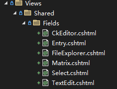

# タグヘルパー

Web開発者がウェブサイトの迅速な開発を支援するために、Dignite Cmsはデータの取得と表示の開発プロセスを簡素化する一連のタグヘルパーを提供しています。

## エントリーリスト

`cms-entry-list`は、エントリーリストを取得し、部分ビューに`EntryListViewModel`型のビューモデルを渡すために使用されます。

### `cms-entry-list`の例

基本的な使い方：

```xml
<cms-entry-list                
                section-name="blog-post"
                partial-name="blog/_post-list">
</cms-entry-list>
```

`_post-list.cshtml`のコード

```html
@using Dignite.Cms.Public.Web.Models;
@using Volo.Abp.AspNetCore.Mvc.UI.Bootstrap.TagHelpers.Pagination;
@model EntryListViewModel
@{
    var pagerModel = new PagerModel(Model.TotalCount, 10, Model.PageIndex, Model.PageSize, Context.Request.Path);
}
 <div class="list-group mb-5">
    @foreach (var entry in Model.Entries)
    {
        <a section="Model.Section" entry="entry" class="list-group-item list-group-item-action">
            <div class="d-flex w-100 justify-content-between mt-2">
                <h5 class="mb-1">@entry.Title</h5>
                <span class="text-muted">@entry.PublishTime</span>
            </div>
        </a>
    }
</div>
<nav aria-label="Pagination navigation" class=" mb-5">
    <div class="flex-grow-1">
        <abp-paginator model="pagerModel" show-info="false" />
    </div>
</nav>
```

10個のエントリーを返す：

```xml
<cms-entry-list                
                section-name="blog-post"
                current-page="10"
                partial-name="blog/_post-list">
</cms-entry-list>
```

現在の言語を指定する：

```xml
<cms-entry-list                 
                section-name="blog-post"
                culture="@Model.Entry.Culture"
                partial-name="blog/_post-list">
</cms-entry-list>
```

フィールド値でクエリを実行する：

> ブログ投稿カテゴリーに基づいてエントリーリストを取得する

```csharp
@using Dignite.Abp.Data;
@using Dignite.Cms.Public.Web.Models;
@model EntryViewModel
@{
    //現在のカテゴリー
    var category = Context.Request.Query["category"].ToString();
    IList<QueryingByField> parameters = null;
    if (!category.IsNullOrWhiteSpace())
    {
        parameters = new List<QueryingByField>
        {
            new QueryingByField("BlogCategory",category)
        };
    }
}
```

```xml
<cms-entry-list                 
                section-name="blog-post"
                querying-by-fields="parameters"
                partial-name="blog/_post-list">
</cms-entry-list>
```

### `cms-entry-list`のパラメータ

- `site-id`：サイトのIDを指定します
- `section-name`：セクションの名前を指定します
- `current-page`：ページ番号を指定します。デフォルト値：1
- `max-result-count`：返される結果の数を指定します。デフォルト値：20
- `culture`：言語を指定します。デフォルト値はサイトのデフォルト言語です
- `querying-by-fields`：フィールド値でエントリーをクエリします（[高度な開発](advanced-development.md#querying-entries-by-fields)ドキュメントを参照）
- `filter`：エントリーの`title`内の文字列をフィルタリングします
- `partial-name`：部分ビュー名を指定します

### `EntryListViewModel`クラスのパラメータ

- `Section`：エントリーリストが属するセクションDTO
- `Entries`：エントリーDTOのリスト
- `TotalCount`：エントリーの総数
- `PageIndex`：ページインデックスの値
- `PageSize`：ページごとのエントリー数
- `CurrentPage`：現在のページ番号
- `TotalPage`：総ページ数

## エントリー

`cms-entry`は、単一のエントリーを取得し、`EntryViewModel`型のビューモデルをビューに渡すために使用されます。

### `cms-entry`の例

```xml
<cms-entry     
    section-name="contact" 
    culture="@Model.Entry.Culture" 
    slug="index" 
    partial-name="_contact-section">
</cms-entry>
```

`_contact-section.cshtml`のコード

```html
@using Dignite.Cms.Public.Web.Models;
@model EntryViewModel
<section class="container mb-5">
    <h2 class="fs-1 fw-semibold lh-base mb-3">@Model.Entry.Title</h2>
    <div class="lead mb-5">
        <cms-entry-field field-name="TextboxFieldName" entry="Model"></cms-entry-field>
    </div>
    <a class="underline-animate ms-3 btn btn-outline-primary" section="@Model.Section" entry="Model.Entry">@localizer["contact-us"]</a>
</section>
```

### `cms-entry`のパラメータ

- `site-id`：サイトのIDを指定します
- `section-name`：セクションの名前を指定します
- `culture`：言語を指定します。デフォルト値：サイトのデフォルト言語
- `slug`：エントリーのエイリアスを指定します
- `partial-name`：部分ビュー名を指定します

### `EntryViewModel`のプロパティ

- `Entry`：`EntryDto`型のエントリーDTO
- `Section`：`SectionDto`型のセクシ

ョンDTO

## エントリーフィールド

`cms-entry-field`は、エントリーフィールドを表示するために使用され、ビューに`EntryFieldViewModel`型のビューモデルを渡します。

### `cms-entry-field`の例

基本的な使い方：

```xml
<cms-entry-field field-name="TextboxFieldName" entry="Model"></cms-entry-field>
```

現在のページで、`Entry`エントリーの`TextboxFieldName`フィールドの値を出力します。デフォルトでは、`/Views/Shared/TextEdit.cshtml`ビューに`EntryFieldViewModel`型のビューモデルを渡します。

フィールド部分ビューページを指定します：

```xml
<cms-entry-field field-name="image" entry="Model" partial-name="_banner"></cms-entry-field>
```

`_banner.cshtml`

```c#
@using Dignite.Abp.Data
@using Dignite.Cms.Public.Web.Models;
@using Dignite.Abp.DynamicForms;
@using Dignite.FileExplorer.Files;
@model EntryFieldViewModel
@{
    var files = Model.Entry.GetField<List<FileDescriptorDto>>(Model.Field.Name);
    FileDescriptorDto coverImage = (files != null && files.Any()) ? files[0] : null;
    var imgUrl =  $"/api/file-explorer/files/{coverImage?.ContainerName}/{coverImage?.BlobName}?width=1650&height=800";
}
@if (coverImage != null)
{
    
}
```

### `cms-entry-field`のパラメータ

- `field-name`：エントリー内のフィールド名
- `entry`：通常は現在のページのViewModelである`EntryViewModel`型のインスタンス
- `partial-name`：フィールド値を表示する部分ビューページ

### `EntryFieldViewModel`のプロパティ

- `Field`：`FormField`型のインスタンス
- `Entry`：`IHasCustomFields`を実装する型のインスタンス

> `EntryDto`は`IHasCustomFields`インターフェースのインスタンスです。

### 事前定義されたフィールドビュー

Dignite Cms Mvcには、動的フィールド用のビューファイルが組み込まれており、動的フィールドタイプに基づいて名前が付けられています。これらは、`Dignite.Cms.Public.Web`プロジェクトの`/Views/Shared/`ディレクトリに配置されています：



## フィールド

`cms-field`は、フィールドの値を表示するために使用され、ビューに`EntryFieldViewModel`型のビューモデルを渡します。

`Service Project`エントリー`/Views/Entry/Service/Entry.cshtml`を例にします：

```xml
<cms-entry-field field-name="Services" entry="Model"></cms-entry-field>
```

`Services`はマトリックスタイプのフィールドであり、最初に`Dignite.Cms.Public.Web`プロジェクトの`/Views/Shared/Matrix.cshtml`ビューファイルを呼び出し、次に`Fields/Matrix/{matrix-block-name}`のビューを内部で呼び出します。

`Service Project`エントリーの例では、`Fields/Matrix/service-item`ビューを呼び出し、完全なビューパスは次のとおりです：`/Views/Shared/Fields/Matrix/service-item.cshtml`：

```c#
@using Dignite.Cms.Public.Web.Models;
@model MatrixBlockViewModel
@{
    var nameField = Model.Type.Fields.First(fd => fd.Name == "name");
    var descriptionField = Model.Type.Fields.First(fd => fd.Name == "description");
}
<h2 class="fs-2 mb-3 fw-bold lh-base">
    <cms-field field="nameField" entry="Model.Block"></cms-field>
</h2>
<div class="rich-text mb-5">
    <cms-field field="descriptionField" entry="Model.Block"></cms-field>
</div>
```

### `cms-field`のパラメータ

- `field`：`FormField`型のインスタンス
- `entry`：`IHasCustomFields`型のインスタンス
- `partial-name`：フィールドの値を表示する部分ビューページ

## エントリーリンク

### エントリーオブジェクトに基づく

```c#
@model EntryListViewModel
@foreach (var entry in Model.Entries)
{
    <a section="Model.Section" entry="entry">
        <h5>@entry.Title</h5>
    </a>
}
```

### パスに基づく

```xml
<a entry-path="~/blog">
    ブログ
</a>
```

オプションのパラメータ：

- `culture`：エントリーの言語を指定します
- `host`：サイトのホストアドレスを指定します

## セクション

`cms-section`はセクションデータを呼び出すために使用され、ビューに`SectionDto`型のビューモデルを渡します。

```xml
<cms-section section-name="blog-post" partial-name="_blog-post-index">
</cms-section>
```
