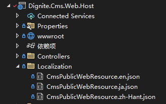
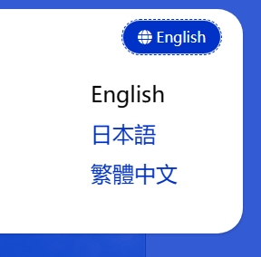

# Mvc网站开发基础知识

本文档介绍基于Dignite Cms开发MVC网站的基础知识。

## 公开应用层

### ISiteSettingsPublicAppService

### API

- `Task<string> GetDefaultLanguageAsync()`

    获取网站的默认语言。

- `Task<IEnumerable<string>> GetAllLanguagesAsync()`
  
    获取网站的所有语言。

- `Task<BrandDto> GetBrandAsync()`

    获取网站的品牌信息。

    `Dignite.Cms.Web.Host\CmsBrandingProvider.cs`文件示范如何获取网站的品牌信息。

### IFieldPublicAppService

#### Api

- `Task<FieldDto> FindByNameAsync(string name)`：

    根据字段名称查找字段，如果找到则返回字段信息，否则返回`null`。

#### `FieldDto`属性

- `Id`：字段的唯一编号
- `Name`：字段的唯一名称
- `DisplayName`：字段的显示名称
- `Description`：字段的描述
- `FormControlName`：字段控件的名称
- `FormConfiguration`：字段控件的配置

### ISectionPublicAppService

#### Api

- `Task<SectionDto> GetAsync(Guid id)`：

    根据id获取版块信息，如果找到则返回版块信息，否则抛出异常。

- `Task<SectionDto> FindByNameAsync(string name)`：

    根据版块名称查找版块，如果找到则返回版块信息，否则返回`null`。

- `Task<SectionDto> FindByRouteAsync( string route)`：

    根据目的Url查找版块（即匹配条目Url的版块），如果找到则返回版块信息，否则返回`null`。

- `Task<SectionDto> GetDefaultAsync()`：

    获取默认版块。

#### `SectionDto`属性

- `Id`：版块的唯一编号
- `Name`：版块的唯一名称
- `DisplayName`：版块的显示名称
- `IsActive`：版块是否激活
- `Type`：版块的类型（详情请参阅[版块](basic-concept.md#版块)）
- `Route`：版块下条目的Url路由
- `Template`：版块下条目的视图模板
- `EntryTypes`：版块的条目类型列表

#### `SectionDto`扩展方法

- `FieldDto GetField(Guid entryTypeId, string name)`：获取指定名称的字段

### IEntryPublicAppService

#### Api

- `Task<EntryDto> FindBySlugAsync(FindBySlugInput input)`：

    根据条目的`Slug`查找条目，如果找到则返回条目信息，否则返回`null`。

    `input`参数包含三个查询条件：
  - `SectionId`：版块Id（必填）
  - `Slug`：条目的别名（必填）
  - `Culture`：条目的文化区域值，默认值为站点的默认语言

- `Task<EntryDto> GetAsync(Guid id)`:

    根据id获取条目，如果找到则返回条目信息，否则抛出异常。

- `Task<EntryDto> FindPrevAsync(Guid id)`:

    查找发布时间比指定`id`条目发布时间早的第一个条目，如果存在则返回条目信息，否则返回`null`。

- `Task<EntryDto> FindNextAsync(Guid id)`:

    查找发布时间比指定`id`条目发布时间晚的第一个条目，如果存在则返回条目信息，否则返回`null`。

- `Task<PagedResultDto<EntryDto>> GetListAsync(GetEntriesInput input)`:
  
    获取符合条件的条目列表。

    `input`参数包含以下查询条件：
  - `SectionId`：版块Id（必填）
  - `Culture`：条目的文化区域值，默认值为站点的默认语言
  - `EntryTypeId`：条目类型Id
  - `CreatorId`：创建人Id
  - `StartPublishDate`：起始发布时间
  - `ExpiryPublishDate`：到期发布时间
  - `Filter`：条目标题中含有的字符
  - `QueryingByFieldsJson`：按字段值查询条目（详情请参阅[进阶开发](advanced-development.md#按字段值查询条目)）

  除按以上条件查询条目以外，还支持按条目Id数组查询列表：
  - `SectionId`：指定版块Id（必填）
  - `EntryIds`：指定一个或多个条目Id

#### `EntryDto`属性

- `Id`：条目的唯一编号
- `CreatorId`：创建人的唯一编号
- `SectionId`：所属版块的唯一编号
- `EntryTypeId`：条目类型的唯一编号
- `Culture`：条目的文化区域
- `Title`：条目的标题
- `Slug`：条目的别名
- `ParentId`：父级条目的唯一编号
- `Order`：条目在版块中的排序值
- `Status`：条目的发布状态，包括`Draft`和`Published`两种状态
- `PublishTime`：条目的发布时间
- `IsActivatedVersion`：是否是激活的版本

#### `EntryDto`扩展方法

- `GetUrl(SectionDto section)`：获取条目的Url

## Mvc 控制器

### EntryController

`EntryController`包含以下`action`：

- `HomePage()`

  查找默认版块下`Slug`为`Index`的条目，并传递 `EntryViewModel` 视图模型给模板页面。

  以[快速入门](quick-start.md)中`Home Page`版块为例，访问`https://localhost:44339`，将获取`Home Page`版块下语言为`en`、`slug`为`index`的条目，并使用`/Views/Entry/HomePage.cshtml`视图呈现页面。

- `EntryPageWithCulture(string culture, string route)`

  查找指定`Culture`和匹配`route`值的条目，并传递 `EntryViewModel` 视图模型给模板页面。

  以[快速入门](quick-start.md)中`Blog Post`版块为例，访问`https://localhost:44339/ja/blog/2024/03/first-blog-post`，将获取`Blog Post`版块下语言为`ja`、`slug`为`first-blog-post`的条目，并使用`/Views/Entry/Blog/Entry.cshtml`视图呈现页面。

- `EntryPage(string route)`

  查找匹配`route`值的条目，并传递 `EntryViewModel` 视图模型给模板页面。

  以[快速入门](quick-start.md)中`Blog Home`版块为例，访问`https://localhost:44339/blog`，将获取`Blog Home`版块下语言为`en`、`slug`为`index`的条目，并使用`/Views/Entry/Blog/Index.cshtml`视图呈现页面。

`EntryViewModel`类包含以下两个属性：

- `Entry`：类型为`EntryDto`的条目
- `Section`：类型为`SectionDto`的版块

## 本地化

Dignite Cms Mvc网站支持多租户独立的本地化功能，使用`CmsPublicWebResource.{culture}.json`文件存储本地化资源。

租主的本地化资源文件存放在`/Localization/`目录下：



租户的本地化资源文件存放在`/Tenants/{租户名称}/Localization/`目录下：


关于多租户本地化功能的使用方法请参阅[多租户本地化](https://learn.dignite.com/zh-Hans/abp/latest/Localization-MultiTenancy)文档。

## 视图组件

### 切换本地化组件

`CultureSwitchViewComponent`组件用于切换本地化。



创建一个实现类并继承`IToolbarContributor`接口，代码如下：

```csharp
public class CmsWebHostToolbarContributor : IToolbarContributor
{
    public virtual Task ConfigureToolbarAsync(IToolbarConfigurationContext context)
    {
        if (context.Toolbar.Name != StandardToolbars.Main)
        {
            return Task.CompletedTask;
        }

        context.Toolbar.Items.Add(new ToolbarItem(typeof(CultureSwitchViewComponent)));

        return Task.CompletedTask;
    }
}
```

在模块类的 ConfigureServices 方法中添加如下代码：

```csharp
Configure<AbpToolbarOptions>(options =>
{
    options.Contributors.Add(new CmsWebHostToolbarContributor());
});
```
