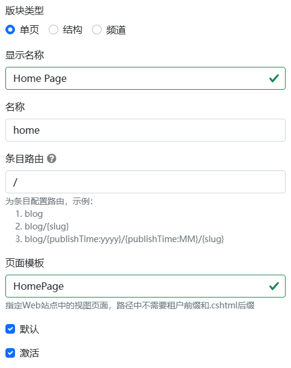

# Dignite Cms基本概念解析

## 站點設置項

Dignite Cms 的設置基於 [Abp Settings](https://abp.io/docs/latest/framework/infrastructure/settings) 模塊，為主站和租戶網站設置語言、品牌信息。

以下是主站的基本設置示例：

```json
"Settings": {
  "Abp.Localization.DefaultLanguage": "en",
  "CmsSettings.Site.Languages": "en,ja,zh-Hant",
  "CmsSettings.Site.Name": "My Dignite",
  "CmsSettings.Site.LogoUrl": "/images/logo.png",
  "CmsSettings.Site.LogoReverseUrl": "/images/logo-reverse.png"
}
```

關於租戶的設置請參見 [Setting Management](https://abp.io/docs/latest/modules/setting-management) 文檔。

## 字段

字段是Dignite Abp中的[動態表單](https://learn.dignite.com/zh-Hans/abp/latest/Dynamic-Forms)實現，通過不同類型的字段和配置，滿足各種頁面展示需求。

**文本編輯字段示例：**


通用屬性：

- 字段標籤：字段的顯示文本
- 字段名稱：字段的唯一標識符
- 字段說明：字段的描述文本
- 字段類型：支持文本框、下拉菜單、富文本編輯、日期選擇、文件上傳、數字框等類型表單

文本編輯字段的配置：

- 文本編輯表單的占位符：在用戶輸入文本前，在文本框內顯示的文本
- 文本編輯表單的模式：包括單行文本框和多行文本框兩種模式
- 文本編輯表單的字數限制：限制用戶輸入文字的最大數量

### 高級表單

除了通用類型的動態表單外，Dignite Cms還提供了三種高級表單類型：

- 條目選擇：配置條目列表的數據源，供用戶選擇條目
- 矩陣：通過配置矩陣塊，實現豐富的結構化內容管理
- 表格：通過配置表格頭，規範用戶輸入的數據

>欲了解更多關於表單的使用，請查看快速入門教程以啟動Dignite Cms Blazor WebAssembly，並在後臺管理中體驗。

## 版塊

版塊是一個網站的骨架，用於將網站內容分區、分塊。



- 版塊類型：包括單頁類型、結構類型和頻道類型三種類型
  
  - 單頁類型：每個版塊中同一條目類型的條目有且只能有一條，用於網站首頁、產品索引頁、博客首頁等
  - 結構類型：適用於開發者預知該類型下的條目數量不會太多，並且需要支持手動排序或多層級結構，比如常見問題解答、服務項目等
  - 頻道類型：適用於不斷發布新內容的場景，支持無限增加條目，比如博客、新聞等

- 顯示名稱：版塊的顯示文本
- 名稱：版塊名稱在同一站點下具備唯一性
- 條目路由：根據不同類型的版塊，可以設置不同的條目路由規則
- 頁面模板：用於展示條目的視圖頁面路徑，不需要包含.cshtml後綴
- 默認：指定網站訪問時的默認版塊，僅適用於單頁類型版塊
- 激活：開啟或禁止用戶對該版塊的訪問
  
## 條目類型

版塊中的條目可以以多種形式存在，比如博客版塊的帖子可以是圖文、視頻或者畫廊形式。每一種類型都可以配置不同的字段，滿足前端UI需求。


- 顯示名稱：條目類型的顯示文本
- 名稱：條目類型名稱在同一版塊下具備唯一性
- 字段布局：字段可以分佈在多個Tab中布局，並且支持設置字段標籤、是否必填以及是否加入列表
- 高級表單：支持條目選擇、矩陣和表格等高級表單類型

## 條目

條目是網站頁面中的內容，條目的數據由字段構成。

條目隸屬於某個版塊，支持多語言和多版本特性。


- 標題：每個條目都具有一個標題
- 表單字段：由條目類型中定義的字段組成
- 別名：每個條目在版塊中具備唯一性
- 語言：條目的語言由站點語言列表配置
- 發布時間：默認為條目的當前時間，支持手動修改發布時間
- 版本：支持多版本功能，每個條目可以創建多個版本，但只有一個激活版本
- 修訂說明：記錄編輯條目時的說明
