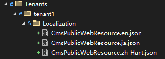

# Mvc網站開發基礎知識

本文件介紹了基於Dignite Cms開發MVC網站的基礎知識。

## 公開應用層

### ISiteSettingsPublicAppService

### API

- `Task<string> GetDefaultLanguageAsync()`

    獲取網站的默認語言。

- `Task<IEnumerable<string>> GetAllLanguagesAsync()`
  
    獲取網站的所有語言。

- `Task<BrandDto> GetBrandAsync()`

    獲取網站的品牌信息。

    `Dignite.Cms.Web.Host\CmsBrandingProvider.cs` 文件示範如何獲取網站的品牌信息。

### IFieldPublicAppService

#### API

- `Task<FieldDto> FindByNameAsync(string name)`：

    根據字段名稱查找字段，如果找到則返回字段信息，否則返回`null`。

#### `FieldDto`屬性

- `Id`：字段的唯一編號
- `Name`：字段的唯一名稱
- `DisplayName`：字段的顯示名稱
- `Description`：字段的描述
- `FormControlName`：字段控件的名稱
- `FormConfiguration`：字段控件的配置

### ISectionPublicAppService

#### API

- `Task<SectionDto> GetAsync(Guid id)`：

    根據id獲取版塊信息，如果找到則返回版塊信息，否則拋出異常。

- `Task<SectionDto> FindByNameAsync(string name)`：

    根據版塊名稱查找版塊，如果找到則返回版塊信息，否則返回`null`。

- `Task<SectionDto> FindByRouteAsync(string route)`：

    根據和條目的Url查找版塊（即匹配條目Url的版塊），如果找到則返回版塊信息，否則返回`null`。

- `Task<SectionDto> GetDefaultAsync()`：

    獲取默認版塊。

#### `SectionDto`屬性

- `Id`：版塊的唯一編號
- `Name`：版塊的唯一名稱
- `DisplayName`：版塊的顯示名稱
- `IsActive`：版塊是否激活
- `Type`：版塊的類型（詳情請參閱[版塊](basic-concept.md#版塊)）
- `Route`：版塊下條目的Url路由
- `Template`：版塊下條目的視圖模板
- `EntryTypes`：版塊的條目類型列表

#### `SectionDto`擴展方法

- `FieldDto GetField(Guid entryTypeId, string name)`：獲取指定名稱的字段

### IEntryPublicAppService

#### API

- `Task<EntryDto> FindBySlugAsync(FindBySlugInput input)`：

    根據條目的`Slug`查找條目，如果找到則返回條目信息，否則返回`null`。

    `input`參數包含三個查詢條件：
  - `SectionId`：版塊Id（必填）
  - `Slug`：條目的別名（必填）
  - `Culture`：條目的文化區域值，默認值為站點的默認語言

- `Task<EntryDto> GetAsync(Guid id)`:

    根據id獲取條目，如果找到則返回條目信息，否則拋出異常。

- `Task<EntryDto> FindPrevAsync(Guid id)`:

    查找發布時間比指定`id`條目發布時間早的第一個條目，如果存在則返回條目信息，否則返回`null`。

- `Task<EntryDto> FindNextAsync(Guid id)`:

    查找發布時間比指定`id`條目發布時間晚的第一個條目，如果存在則返回條目信息，否則返回`null`。

- `Task<PagedResultDto<EntryDto>> GetListAsync(GetEntriesInput input)`:
  
    獲取符合條件的條目列表。

    `input`參數包含以下查詢條件：
  - `SectionId`：版塊Id（必填）
  - `Culture`：條目的文化區域值，默認值為站點的默認語言
  - `EntryTypeId`：條目類型Id
  - `CreatorId`：創建人Id
  - `StartPublishDate`：起始發布時間
  - `ExpiryPublishDate`：到期發布時間
  - `Filter`：條目標題中含有的字符
  - `QueryingByFieldsJson`：按字段值查詢條目（詳情請參閱[進階開發](advanced-development.md#按字段值查詢條目)）

  除按以上條件查詢條目以外，還支持按條目Id數組查詢列表：
  - `SectionId`：指定版塊Id（必填）
  - `EntryIds`：指定一個或多個條目Id

#### `EntryDto`屬性

- `Id`：條目的唯一編號
- `CreatorId`：創建人的唯一編號
- `SectionId`：所屬版塊的唯一編號
- `EntryTypeId`：條目類型的唯一編號
- `Culture`：條目的文化區域
- `Title`：條目的標題
- `Slug`：條目的別名
- `ParentId`：父級條目的唯一編號
- `Order`：條目在版塊中的排序值
- `Status`：條目的發布狀態，包括`Draft`和`Published`兩種狀態
- `PublishTime`：條目的發布時間
- `IsActivatedVersion`：是否是激活的版本

#### `EntryDto`擴展方法

- `GetUrl(SectionDto section)`：獲取條目的Url

## Mvc 控制器

### EntryController

`EntryController`包含以下`action`：

- `HomePage()`

  查找默認版塊下`Slug`為`Index`的條目，並傳遞 `EntryViewModel` 視圖模型給模板頁面。

  以[快速入門](quick-start.md)中`Home Page`版塊為例，訪問`https://localhost:44339`，將獲取`Home Page`版塊下語言為`en`、`slug`為`index`的條目，並使用`/Views/Entry/HomePage.cshtml`視圖呈現頁面。

- `EntryPageWithCulture(string culture, string route)`

  查找指定`Culture`和匹配`route`值的條目，並傳遞 `EntryViewModel` 視圖模型給模板頁面。

  以[快速入門](quick-start.md)中`Blog Post`版塊為例，訪問`https://localhost:44339/ja/blog/2024/03/first-blog-post`，將獲取`Blog Post`版塊下語言為`ja`、`slug`為`first-blog-post`的條目，並使用`/Views/Entry/Blog/Entry.cshtml`視圖呈現頁面。

- `EntryPage(string route)`

  查找匹配`route`值的條目，並傳遞 `EntryViewModel` 視圖模型給模板頁面。

  以[快速入門](quick-start.md)中`Blog Home`版塊為例，訪問`https://localhost:44339/blog`，將獲取`Blog Home`版塊下語言為`en`、`slug`為`index`的條目，並使用`/Views/Entry/Blog/Index.cshtml`視圖呈現頁面。

`EntryViewModel`類包含以下兩個屬性：

- `Entry`：類型為`EntryDto`的條目
- `Section`：類型為`SectionDto`的版塊

## 本地化

Dignite Cms Mvc網站支持多租戶獨立的本地化功能，使用`CmsPublicWebResource.{culture}.json`文件存儲本地化資源。

租主的本地化資源文件存放在`/Localization/`目錄下：


租戶的本地化資源文件存放在`/Tenants/{租戶名稱}/Localization/`目錄下：



關於多租戶本地化功能的使用方法請參閱[多租戶本地化](https://learn.dignite.com/zh-Hans/abp/latest/Localization-MultiTenancy)文檔。

## 視圖組件

### 切換本地化組件

`CultureSwitchViewComponent`組件用於切換本地化。


創建一個實現類並繼承`IToolbarContributor`接口，代碼如下：

```csharp


public class CmsWebHostToolbarContributor : IToolbarContributor
{
    public virtual Task ConfigureToolbarAsync(IToolbarConfigurationContext context)
    {
        if (context.Toolbar.Name != StandardToolbars.Main)
        {
            return Task.CompletedTask;
        }

        context.Toolbar.Items.Add(new ToolbarItem(typeof(CultureSwitchViewComponent)));

        return Task.CompletedTask;
    }
}
```

在模塊類的 ConfigureServices 方法中添加如下代碼：

```csharp
Configure<AbpToolbarOptions>(options =>
{
    options.Contributors.Add(new CmsWebHostToolbarContributor());
});
```
