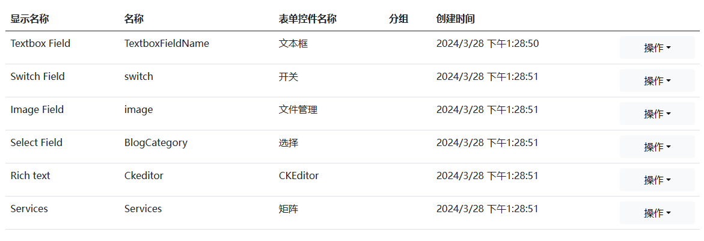
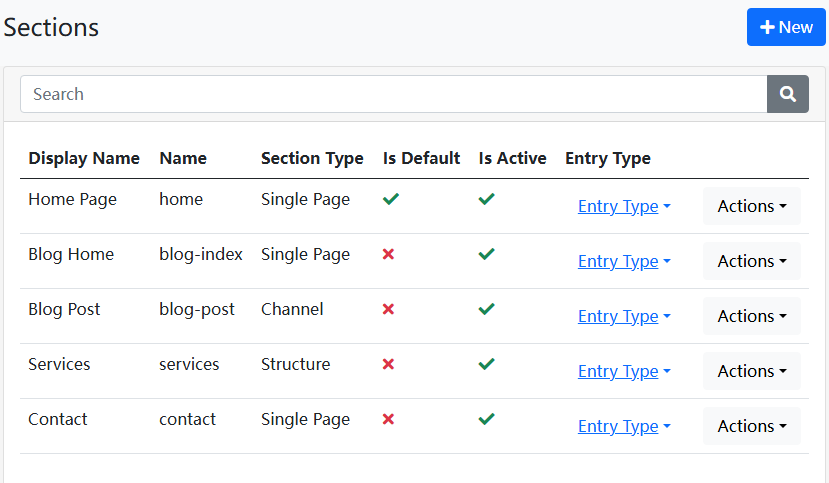
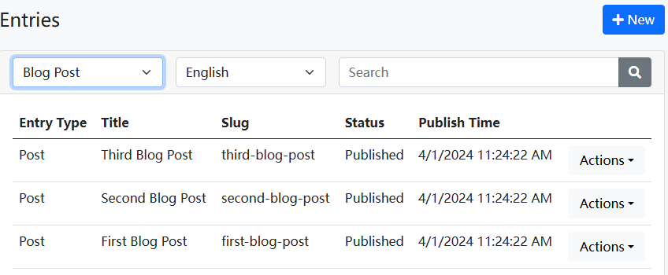

# Dignite Cms後台系統啟動指南

Dignite Cms的後台系統基於Blazor技術，提供了Blazor WebAssembly和Blazor Server兩種運行模式。以下是啟動後台系統的詳細步驟：

````json
//[doc-params]
{
    "UI": ["Blazor","BlazorServer"]
}
````

{{if UI == "Blazor"}}

## 使用Blazor WebAssembly方式啟動

1. **啟動IdentityServer**

    在終端中，進入`host\Dignite.Cms.IdentityServer`目錄，並執行以下命令：

    ```bash
    dotnet ef database update
    ```

    ```bash
    dotnet run
    ```

2. **啟動HttpApi.Host**

    在終端中，進入`host\Dignite.Cms.HttpApi.Host`目錄，並執行以下命令：

    ```bash
    dotnet ef database update
    ```

    ```bash
    abp install-libs
    ```

    ```bash
    dotnet run
    ```

    > 第一次運行時，系統將自動創建種子數據。

3. **啟動Blazor.Host**

    在終端中，進入`host\Dignite.Cms.Blazor.Host`目錄，並執行以下命令：

    ```bash
    dotnet run
    ````

    在瀏覽器中訪問`https://localhost:44307`地址即可進入Dignite Cms後台。

    > 初始帳號： admin
    >
    > 初始密碼： 1q2w3E*

4. **啟動MVC網站**

    在終端中，進入`host\Dignite.Cms.Web.Host`目錄，並執行以下命令：

    ```bash
    abp install-libs
    ```

    ```bash
    dotnet run
    ```

    在瀏覽器中訪問`https://localhost:44339`地址即可進入Dignite Cms MVC網站。

{{end}}

{{if UI == "BlazorServer"}}

## 使用Blazor Server方式啟動

在終端中，進入`host\Dignite.Cms.Blazor.Server.Host`目錄，並執行以下命令：

```bash
dotnet ef database update
```

```bash
dotnet run
```

在瀏覽器中訪問`https://localhost:44361`地址即可進入Dignite Cms後台。

{{end}}

## 功能概覽

### 字段管理

字段用於定義條目的屬性，系統預設了一些字段方便使用。



### 版塊管理

版塊是站點的骨架，用於支撐條目的結構布局，系統自動創建了一些常用版塊。



### 條目類型管理

條目類型用於定義版塊下條目應用哪些字段，每個版塊可以配置多個條目類型。


### 條目管理

條目是網站中各個版塊的內容，支持多語言和多版本特性。




