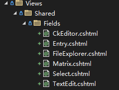

# 標籤輔助工具

為了幫助網頁開發者快速開發網站，Dignite Cms 提供了一系列標籤輔助工具，用於簡化數據獲取和展示的開發流程。

## 條目列表

`cms-entry-list`用於獲取條目列表，並將`EntryListViewModel`類型的視圖模型傳遞給部分視圖。

### `cms-entry-list`範例

基本用法：

```xml
<cms-entry-list 
                section-name="blog-post"
                partial-name="blog/_post-list">
</cms-entry-list>
```

`_post-list.cshtml` 代碼

```html
@using Dignite.Cms.Public.Web.Models;
@using Volo.Abp.AspNetCore.Mvc.UI.Bootstrap.TagHelpers.Pagination;
@model EntryListViewModel
@{
    var pagerModel = new PagerModel(Model.TotalCount, 10, Model.PageIndex, Model.PageSize, Context.Request.Path);
}
 <div class="list-group mb-5">
    @foreach (var entry in Model.Entries)
    {
        <a section="Model.Section" entry="entry" class="list-group-item list-group-item-action">
            <div class="d-flex w-100 justify-content-between mt-2">
                <h5 class="mb-1">@entry.Title</h5>
                <span class="text-muted">@entry.PublishTime</span>
            </div>
        </a>
    }
</div>
<nav aria-label="Pagination navigation" class=" mb-5">
    <div class="flex-grow-1">
        <abp-paginator model="pagerModel" show-info="false" />
    </div>
</nav>
```

返回10條條目：

```xml
<cms-entry-list 
                section-name="blog-post"
                current-page="10"
                partial-name="blog/_post-list">
</cms-entry-list>
```

指定當前語言：

```xml
<cms-entry-list 
                section-name="blog-post"
                culture="@Model.Entry.Culture"
                partial-name="blog/_post-list">
</cms-entry-list>
```

按字段值查詢：

> 按博客帖子分類獲取條目列表

```csharp
@using Dignite.Abp.Data;
@using Dignite.Cms.Public.Web.Models;
@model EntryViewModel
@{
    //current category
    var category = Context.Request.Query["category"].ToString();
    IList<QueryingByField> parameters = null;
    if (!category.IsNullOrWhiteSpace())
    {
        parameters = new List<QueryingByField>
        {
            new QueryingByField("BlogCategory",category)
        };
    }
}
```

```xml
<cms-entry-list 
                section-name="blog-post"
                querying-by-fields="parameters"
                partial-name="blog/_post-list">
</cms-entry-list>
```

### `cms-entry-list`的參數

- `section-name`：指定版塊的名稱
- `current-page`：指定分頁數字，默认值：1
- `max-result-count`：指定返回結果的數量，默认值：20
- `culture`：指定語言，默认值為站點的默認語言
- `querying-by-fields`：按字段值查詢條目（請參閱[進階開發](advanced-development.md#按字段值查询条目)文檔）
- `filter`：在條目`title`中過濾字符串
- `partial-name`：指定部分視圖名稱

### `EntryListViewModel`類的參數

- `Section`：條目列表所屬版塊Dto
- `Entries`：條目Dto列表
- `TotalCount`：條目總數
- `PageIndex`：分頁索引數值
- `PageSize`：每頁條目數量
- `CurrentPage`：當前分頁數
- `TotalPage`：總分頁數

## 條目

`cms-entry`用於獲取單條條目，並將`EntryViewModel`類型的視圖模型傳遞給視圖。

### `cms-entry`範例

```xml
<cms-entry 
    section-name="contact" 
    culture="@Model.Entry.Culture" 
    slug="index" 
    partial-name="_contact-section">
</cms-entry>
```

`_contact-section.cshtml` 代碼

```html
@using Dignite.Cms.Public.Web.Models;
@model EntryViewModel
<section class="container mb-5">
    <h2 class="fs-1 fw-semibold lh-base mb-3">@Model.Entry.Title</h2>
    <div class="lead mb-5">
        <cms-entry-field field-name="TextboxFieldName" entry="Model"></cms-entry-field>
    </div>
    <a class="underline-animate ms-3 btn btn-outline-primary" section="@Model.Section" entry="Model.Entry">@localizer["contact-us"]</a>
</section>
```

### `cms-entry`的參數

- `section-name`：指定版塊的名稱
- `culture`：指定語言，默认值：站點的默認語言
- `slug`：指定條目的別名
- `partial-name`：指定部分視圖名稱

### `EntryViewModel`屬性

- `Entry`：類型為`EntryDto`的條目
- `Section`：類型為`SectionDto`的版塊

## 條目的字段值

`cms-entry-field`用於條目字段的展示，向視圖傳遞`EntryFieldViewModel`類型的視圖模型。

### `cms-entry-field`範例

基本用法：

```xml
<cms-entry-field field-name="TextboxFieldName" entry="Model"></cms-entry-field

>
```

輸出當前頁面中`Entry`條目字段名稱為`TextboxFieldName`的值，默認情況下，將向`/Views/Shared/TextEdit.cshtml`視圖傳遞`EntryFieldViewModel`類型的視圖模型。

指定字段部分視圖頁面：

```xml
<cms-entry-field field-name="image" entry="Model" partial-name="_banner"></cms-entry-field>
```

`_banner.cshtml`

```c#
@using Dignite.Abp.Data
@using Dignite.Cms.Public.Web.Models;
@using Dignite.Abp.DynamicForms;
@using Dignite.FileExplorer.Files;
@model EntryFieldViewModel
@{
    var files = Model.Entry.GetField<List<FileDescriptorDto>>(Model.Field.Name);
    FileDescriptorDto coverImage = (files != null && files.Any()) ? files[0] : null;
    var imgUrl =  $"/api/file-explorer/files/{coverImage?.ContainerName}/{coverImage?.BlobName}?width=1650&height=800";
}
@if (coverImage != null)
{
    
}
```

### `cms-entry-field`的參數

- `field-name`：條目中的字段名稱
- `entry`：類型為`EntryViewModel`的實例，通常情況下為當前頁面的ViewModel
- `partial-name`：用於展示字段值的部分視圖頁面

### `EntryFieldViewModel`屬性

- `Field`：類型為`FormField`的實例
- `Entry`：接口`IHasCustomFields`的實例

> `EntryDto`是`IHasCustomFields`接口的實例。

### 預設的字段視圖

Dignite Cms Mvc為動態字段內置了視圖文件，以動態字段類型命名，放置在`Dignite.Cms.Public.Web`項目`/Views/Shared/`目錄下：



## 字段

`cms-field`用於字段值的展示，向視圖傳遞`EntryFieldViewModel`類型的視圖模型。

以本示例中`服務項目`條目`/Views/Entry/Service/Entry.cshtml`為例：

```xml
<cms-entry-field field-name="Services" entry="Model"></cms-entry-field>
```

`Services`是一個矩陣類型的字段，先調用`Dignite.Cms.Public.Web`項目`/Views/Shared/Matrix.cshtml`視圖文件，然後在內部調用`Fields/Matrix/{矩陣塊名稱}`的視圖。

在`服務項目`條目示例中調用`Fields/Matrix/service-item`視圖，完整視圖路徑為:`/Views/Shared/Fields/Matrix/service-item.cshtml`：

```c#
@using Dignite.Cms.Public.Web.Models;
@model MatrixBlockViewModel
@{
    var nameField = Model.Type.Fields.First(fd => fd.Name == "name");
    var descriptionField = Model.Type.Fields.First(fd => fd.Name == "description");
}
<h2 class="fs-2 mb-3 fw-bold lh-base">
    <cms-field field="nameField" entry="Model.Block"></cms-field>
</h2>
<div class="rich-text mb-5">
    <cms-field field="descriptionField" entry="Model.Block"></cms-field>
</div>
```

### `cms-field`的參數

- `field`：類型為`FormField`的實例
- `entry`：接口`IHasCustomFields`的實例
- `partial-name`：用於展示字段值的部分視圖頁面

## 條目的鏈接

### 基於條目對象

```c#
@model EntryListViewModel
@foreach (var entry in Model.Entries)
{
    <a section="Model.Section" entry="entry">
        <h5>@entry.Title</h5>
    </a>
}
```

### 基於路徑

```xml
<a entry-path="~/blog">
    Blog
</a>
```

可選參數：

- `culture`：指定條目的語言
- `host`：指定站點主機地址

## 版塊

`cms-section`用於版塊數據的調用，向視圖傳遞`SectionDto`類型的視圖模型。

```xml
<cms-section section-name="blog-post" partial-name="_blog-post-index">
</cms-section>
```
